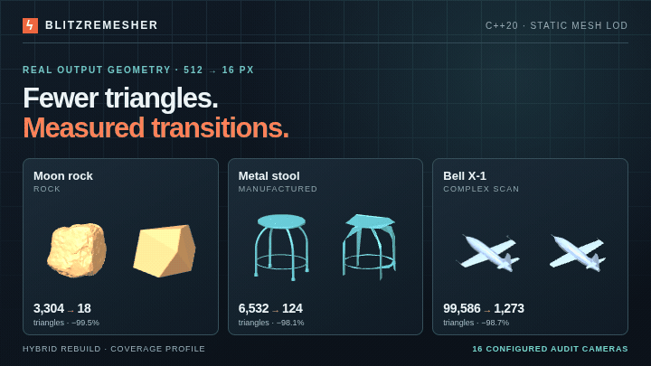

# BlitzRemesher

C++20 library and command-line tool for static, opaque game-mesh LOD chains.
It searches for fewer triangles under explicit screen-space transition and
LOD0 error limits. Every returned reduction passes the configured camera
audit. This is an early research implementation, not a claim of universal
view coverage or globally optimal simplification.

The meshes are enlarged to show each LOD; labels give their target screen sizes.
[Inspect the chains, audits, and source credits](research/round4/board/README.md).

[Automatic hybrid research](research/hybrid/REPORT.md) compares resident buffer
bytes and triangle counts, with measured bake times and independent tail checks.
[Open the current offline board](research/hybrid/board/index.html).
[Previous shared/rebuilt comparisons](research/vegetation/REPORT.md) remain archived.
These experiments score opaque card geometry; texture opacity and shading remain
outside their contract.

## Build

On the supplied NixOS workstation:

    nix develop .
    cmake --preset release
    cmake --build --preset release
    ctest --preset release

Elsewhere, use CMake 3.20+, a C++20 compiler and the dependencies described in
[third_party/README.md](third_party/README.md). A library-only build needs no
third-party runtime libraries:

    cmake -S . -B build/core -DBLITZ_TOOLS=OFF -DBUILD_TESTING=OFF
    cmake --build build/core

## Generate a chain

    build/release/blitz defaults > settings.json
    build/release/blitz info model.glb
    build/release/blitz simplify model.glb --config settings.json --out output/model

The quality defaults audit 642 orthographic and 64 perspective cameras at
8× supersampling, refining uncertain coverage to 16×/32×. This can be
expensive. [The small automatic configuration](configs/automatic-fast.json)
is useful for a quick first run; it has a different, much smaller camera
contract and must not be described as the default quality audit.
Use [the experimental changed-area preset](configs/quality-area-0.5.json) to cap
coverage change at 50% on every configured full audit view while retaining the
default camera and pixel-distance settings. It sets triangle overhead to zero,
so final selection favors the fewest triangles across the audited LOD chain:

    build/release/blitz simplify model.glb --config configs/quality-area-0.5.json --out output/model

The [pilot report](research/area-v3/REPORT.md) and [interactive board](research/area-v3/board/index.html)
show the coverage gain and triangle cost. An independent rotated camera audit
found a 51.29% changed-area view on the pilot tree, so this preset has not
passed the release promotion check. Finite camera audits do not bound every view.
The [strict 2 px comparison board](research/area-v3/strict-board/index.html)
shows the same eight objects with 3 px and 4 px source caps.
The [opt-in conditional topology fallback](research/area-v3/README.md) explores
additional triangle reductions when quadric simplification stalls; it remains
experimental and adds reduction work beyond the configured proposal budget.

Inputs: glTF/GLB, OBJ, triangulated ASCII/binary PLY, ASCII/binary STL.
glTF scene transforms, mirrored winding, strided/sparse accessors and
multiple material primitives are handled. Alpha materials, animation,
skinning, morph targets and compressed mesh extensions are rejected.
Only the first UV and vertex-color sets are imported. RGB streams are
interpreted as linear. Vertex colors are stored as four RGBA8 bytes (0..255
per channel). Normalized float and 16-bit file colors are rounded on import;
nonfinite or out-of-range channels are rejected. Missing alpha becomes 255.

Output contains chain.gltf, chain.bin and lods.json. The default glTF scene
contains LOD0; other LOD meshes are identified in the manifest. Automatic generation can share original vertex accessors or write compact new
vertex buffers for each level. The manifest records which storage each LOD uses.
For the CLI, original means the decoded mesh after import transforms;
compressed or quantized source-file bytes are not preserved verbatim.
The diagnostic exporter writes placeholder materials with stable material
IDs and double-sided flags. It does not copy texture images or the original
material graph. Engine integrations retain their own material payloads.

## Controls

- Automatic hybrid chooses the smallest resident vertex/index payload within
  `triangle_overhead_bps` of a triangle-minimizing reference chain found by the
  search. Default 500 means 5%; each LOD must satisfy its own integer bound.
  Set 0 for no per-level triangle overhead. This is a bounded search, not a global optimum.
- Both original-source and preceding-LOD proposals undergo source and transition
  audits. Shared levels preserve source vertex bytes and IDs; owned levels are compact.
  The reference and selected candidate costs and a 0/2/5/10% selection sweep are recorded.
- Profiles: coverage, normals, attributes. The pixel-distance metric measures
  foreground displacement. `max_changed_area` independently caps `1 - mask IoU`
  for conservative, supersampled opaque coverage on each full audit view.
  `1.0` disables this extra gate; the supplied experimental preset uses `0.5`.
  Source and preceding-LOD comparisons must each pass. Appearance weights
  support curves and can be zero.
- Scale: pixels_per_meter × source bounding-sphere diameter × meters_per_unit,
  or explicit base_pixels. Screen sizes decrease geometrically to last_pixels.
- Limits: transition is a piecewise-linear pixel curve; max_lod0_delta_px is
  an optional source cap. The cumulative source policy is checked directly,
  rather than treated as a mathematical composition guarantee.
- coupled_wedges (enabled by default) enables synchronized positional reduction across separate
  attribute wedges in rebuild mode. Original UV charts and attributes stay
  separate. Endpoint proposals preserve source vertices where possible.
- Candidate budget, beam width, camera sets, supersampling, pruning and
  scalar/AVX2 dispatch are explicit settings.
- Coverage-profile generation reuses exact packed masks and distance fields.
  C++/CLI `research.coverage_cache_mib` accepts 0..256 MiB per bake, default 256;
  0 disables caching. The allowance covers retained payload and entry capacities,
  including entry-array growth. Evaluator scratch and allocator bookkeeping are additional.
  [Five paired pilot runs](research/audit-cache/REPORT.md) measured 40.35% less
  generation time with identical output and audit records at 256 MiB.

Per-LOD JSON reports `changed_area` and `changed_area_worst_view` separately for
source and adjacent audits. Rejection counts include `area_only_count` for
audited candidates that met the pixel limit but failed the area limit. Search
views filter proposals by pixel distance; they do not enforce the area cap.

The C++ and CLI `research` settings expose opt-in boundary quadrics, constrained
boundary placement, independent index-chart contractions, adaptive target
selection, component subset proposals, and proposal traces. Defaults are
unchanged. Component and independent-chart experiments require the coverage
profile; every proposal still passes the existing source and adjacent gates.
See the [measured preset and limitations](research/vegetation/REPORT.md).
Forced whole-chain placements (`research.output`) and proposal origins
(`research.chain`) are also research controls. These options are absent from
the C descriptor. Archived top-level output/chain JSON requires the explicit
`--legacy-config` simplify option; normal `--config` rejects it. C++ clients must rebuild.

LOD0 is always unchanged. Cancellation returns an exact, validated source
chain with cancelled status; the implementation does not yet preserve a
partially optimized prefix on cancellation. Success means the configured
search and audit finished, not that no better reduction exists.

## Engine integration

The C++ entry point is blitz::generate(MeshView, Settings). MeshView borrows
strided streams; Result owns rebuilt vertices and output indices. Keep the
source alive and unchanged until all result views are finished.

The versioned [C API](include/blitz/blitz.h) exposes plain descriptors,
explicit status/error buffers and an opaque result handle:

1. Initialize blitz_settings with blitz_settings_init.
2. Fill blitz_mesh with float geometry streams, RGBA8 colors and aligned uint32 indices.
3. Call blitz_generate.
4. Read each LOD with blitz_result_lod.
5. Call blitz_result_destroy exactly once.

Scheduled slots retain their source and transition audit records. For engine
runtime selection, use `blitz_result_runtime_lod_count` and
`blitz_result_runtime_lod_index` (C++: `runtime_levels`) to skip exact
consecutive duplicates. The returned indices address the scheduled slots;
use each retained slot's original screen threshold. Equal triangle counts
alone never cause a merge. glTF export shares one mesh and buffer payload for
each identical consecutive group, while `lods.json` preserves every audit.

`blitz/render_cost.hpp` exposes optional, deterministic CPU geometry
diagnostics: projected tiny triangles, zero-sample primitives, per-primitive
2×2 quad occupancy and pre-depth overlap. They do not change the quality
score and are not measurements of GPU execution time.

Source storage is never freed by the library. Returned views are read-only,
borrow result/source storage and expire at result destruction. No exception
or STL object crosses the C ABI. Cancellation callbacks must not throw or
mutate the source. The library creates no background threads.

## Corpus and research

The frozen [corpus manifest](research/corpus.json) records 120 assets,
checksums, provenance, item-level scan rights and grouped 80/20/20 splits.
Meshes are stored in data and excluded from Git. Replay the exact inputs:

    build/release/blitz-corpus data research/corpus.json
    build/release/blitz corpus-check data/manifest.json research/corpus-check.json

The acquisition manifest in data is written by catalog acquisition
(blitz-corpus data); frozen replay verifies/downloads files without rewriting
the frozen manifest. On a fresh checkout, use research/corpus.json as the
input to corpus-check instead of data/manifest.json.

Before freezing, category mismatches and a 17-million-triangle tree were
replaced. The corpus resource cap is two million source triangles per asset;
these decisions precede all scored comparisons. Original rejected download
records remain in the acquisition manifest. No scored asset is removed to
improve a score.

    bash tools/stamp-build.sh build/release/blitz-build.json build/release/blitz
    build/release/blitz bench research/pilot.json configs/automatic-fast.json \
        research/runs/example --build-stamp build/release/blitz-build.json
    build/release/blitz-microbench

Run focused tests and one or two development assets with `--limit` before a
complete pilot. Partial runs are smoke checks, not aggregate scores. Compare
promising methods on the same frozen pilot scenario before validation and
full-corpus runs. For tail changes, report final and last-three retained ratios
alongside SCORE; for render-cost changes, report coverage alongside cost proxies.
A changed source cap, starting size, or level count is a different scenario.
Version scoring-protocol changes and rerun every baseline before comparing scores.

Runs checkpoint per asset. Resume requires identical executable,
configuration, camera, protocol and source hashes. Batches stop at 50 minutes.
Do not run more than four CPU workers or exceed 24 GiB combined memory.
The runner is sequential; independent batches may run concurrently within
those limits.
Stamp each frozen executable immediately after building it and pass its own
`--build-stamp` path when benchmark jobs overlap; do not pair it with a mutable
stamp from another build.

External references are separate executables:

    cmake --preset research
    cmake --build --preset research
    build/release/blitz bench research/pilot.json configs/research-quadric.json research/runs/meshopt --baseline meshopt

Baseline names: meshopt, fastquadric, cgal-lt, cgal-qem, cgal-probabilistic.
The initial adapters compare single-material geometry under the coverage
profile. Unsupported inputs/capabilities are recorded as failures with
unchanged-chain score contribution; they are not silently repaired.
CGAL and Fast Quadric adapters support rebuild only.

Read [the algorithm review](research/ALGORITHMS.md),
[the scoring protocol](research/PROTOCOL.md), and
[the accepted specification](docs/SPEC.md) before modifying research rules.
Measured runs, including negative findings, are in
[RESULTS.md](research/RESULTS.md) and [EXPERIMENTS.md](research/EXPERIMENTS.md).
The latest [Round 4 report](research/round4/REPORT.md) studies 128/512/1024 px
starting sizes, source caps, six/eight levels and final-LOD rendering costs.
The [visual board](research/foliage/board/index.html) shows four actual
512→16 px chains with rotation, wireframe, silhouette, source comparison and
an exact-duplicate runtime toggle, measured bake seconds and vertex-storage
labels. It also includes six newly baked nature chains from the 40-model CC0
[foliage library](research/foliage/README.md), with a
[complete source catalog](research/foliage/board/catalog.html).
It opens offline without a server. [PNG](research/foliage/board/board.png) and
[PDF](research/foliage/board/board.pdf) versions are available for sharing.
Nature chains audit full card geometry; texture opacity and shading are excluded,
and no foliage SCORE is reported. The first four chains and score charts are
archived protocol v1 Round 4 observations; the six nature rows use the current
library. See [nature measurements](research/foliage/CHAINS.md) and
[board reproduction](research/foliage/README.md).
The earlier [32→16 px board](research/board/index.html) remains archived.

## Validation

    cmake --preset sanitize -DBLITZ_FUZZ=ON
    cmake --build --preset sanitize
    ctest --preset sanitize
    build/sanitize/blitz-fuzz tests/fuzz-corpus -max_total_time=60 -seed=2971082790

Tests cover the C ABI, strided immutable reuse, scheduling, direct/source
gates, zero weights, empty raster behavior, brute-force Hausdorff reference,
scalar/SIMD agreement, degenerate input, coupled wedges, cancellation and
import/export transforms. The fuzzer instruments the actual reducer.
See [the validation record](research/VALIDATION.md) for compiler, sanitizer,
installed-package and corpus results, with their limits.

The native library is MIT OR Apache-2.0. Optional CGAL benchmark source is
GPL-3.0-or-later; downloaded assets and vendored dependencies have their own
licenses.

Installed CMake consumers use find_package(BlitzRemesher CONFIG REQUIRED)
and link Blitz::remesher. BUILD_SHARED_LIBS=ON builds shared libraries.
The C++ package propagates its C++20 requirement to consumers.

Version 0.4 uses C ABI 4 and shared-library compatibility version 4. C callers
must rebuild and reinitialize the enlarged `blitz_settings` descriptor;
`blitz_lod_info` now reports both coverage-area measurements and worst views.
Version 0.3 replaced
`output_mode`/`chain_mode` with `triangle_overhead_bps`; use
`blitz_result_storage` and per-LOD `reference_triangles` to inspect the result. C++ colors
are `ColorRGBA8`; C colors are `blitz_color_rgba8`. Migrate old float colors
before calling the library; older ABI descriptors are rejected. Strided
RGBA8 streams need only byte alignment and retain their original bytes in reuse.
Rebuilt colors are rounded when stored; raster interpolation remains floating
point. Exported glTF uses normalized unsigned-byte colors and PLY uses uchar RGBA.

Production uses one precision configuration: float32 positions, normals, UVs
and tangents, RGBA8 colors, double quadrics and double candidate costs.
Coverage-only evaluation always uses packed masks; normal/attribute profiles
and reference tests retain the full rasterizer. Experimental precision switches
have been removed. Their results and restoration patch remain in the
[research archive](research/precision/ARCHIVE.md).
Optional C++ `PerformanceStats` accumulates stage times, numerical counters,
coverage raster/field builds, cache hits/bypasses and peak charged cache bytes;
`generate` resets it and `evaluate` adds to it. No instrumentation runs unless
the caller supplies the borrowed pointer. The benchmark runner enables it,
records the compiled storage configuration, and hashes canonical input attributes.
C++ consumers must rebuild for the enlarged research settings and statistics.
The coverage cache leaves the C descriptor and ABI version 4 unchanged.
Protocol v2 results must be compared with freshly rerun v2 baselines.
Measured speed, memory, quality changes and the complete validation matrix are
in [the precision report](research/precision/REPORT.md).
