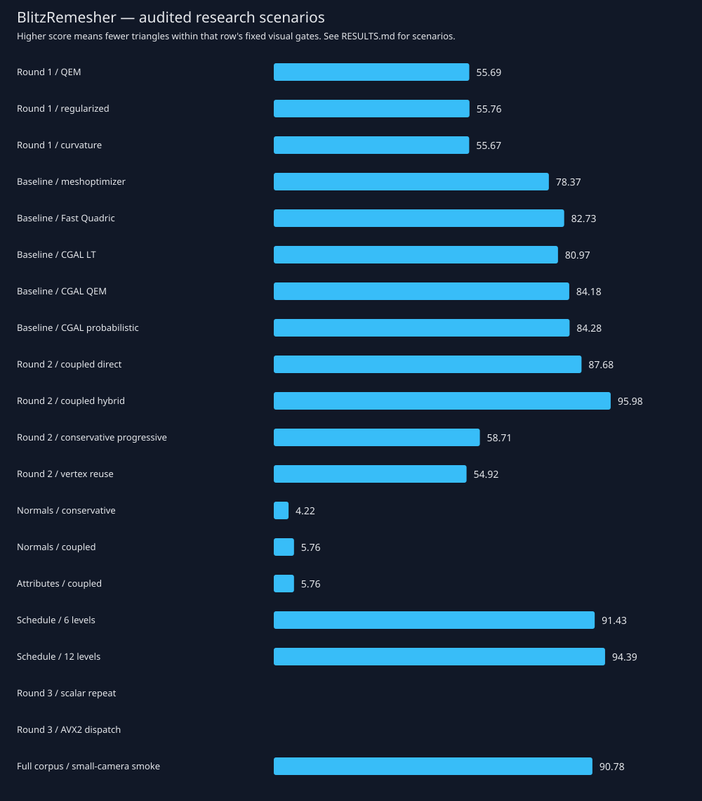

# Recorded experiments

Three research rounds on the frozen eight-asset development pilot, followed by a 120-asset smoke scenario. Screen size 32 to 16 pixels; search 6+2 and audit 12+4 cameras, with 2x/4x sampling refined to 8x. These are not the default quality preset. Profiles, chain modes, level counts, work budgets and corpus selections are separate scenarios. Detailed hypotheses and limitations are in EXPERIMENTS.md.

SCORE = 100 × (1 − category-balanced mean retained triangle ratio). Compare rows only within the stated scenario. Failed assets remain in the denominator. An incomplete run has no score.

| Round / variant | Scenario | Complete | SCORE | Seconds | Fallbacks | Failed assets |
|---|---|---:|---:|---:|---:|---:|
| [Round 1 / QEM](runs/round1-qem/summary.json) | rebuild/coverage/direct, N=8, budget=8 | 8/8 | 55.69 | 92.01 | 0 | 0 |
| [Round 1 / regularized](runs/round1-regularized/summary.json) | rebuild/coverage/direct, N=8, budget=8 | 8/8 | 55.76 | 89.90 | 0 | 0 |
| [Round 1 / curvature](runs/round1-visual/summary.json) | rebuild/coverage/direct, N=8, budget=8 | 8/8 | 55.67 | 91.43 | 0 | 0 |
| [Baseline / meshoptimizer](runs/baseline-meshopt/summary.json) | rebuild/coverage/direct, N=8, budget=8 | 8/8 | 78.37 | 92.13 | 1 | 0 |
| [Baseline / Fast Quadric](runs/baseline-fastquadric/summary.json) | rebuild/coverage/direct, N=8, budget=8 | 8/8 | 82.73 | 77.76 | 0 | 0 |
| [Baseline / CGAL LT](runs/baseline-cgal-lt/summary.json) | rebuild/coverage/direct, N=8, budget=8 | 8/8 | 80.97 | 138.80 | 1 | 1 |
| [Baseline / CGAL QEM](runs/baseline-cgal-qem/summary.json) | rebuild/coverage/direct, N=8, budget=8 | 8/8 | 84.18 | 101.96 | 1 | 1 |
| [Baseline / CGAL probabilistic](runs/baseline-cgal-probabilistic/summary.json) | rebuild/coverage/direct, N=8, budget=8 | 8/8 | 84.28 | 116.48 | 1 | 1 |
| [Round 2 / coupled direct](runs/round2-coupled/summary.json) | rebuild/coverage/direct, N=8, budget=8 | 8/8 | 87.68 | 82.34 | 0 | 0 |
| [Round 2 / coupled hybrid](runs/round2-hybrid/summary.json) | rebuild/coverage/hybrid, N=8, budget=8 | 8/8 | 95.98 | 66.12 | 0 | 0 |
| [Round 2 / conservative progressive](runs/round2-progressive/summary.json) | rebuild/coverage/progressive, N=8, budget=8 | 8/8 | 58.71 | 93.06 | 0 | 0 |
| [Round 2 / vertex reuse](runs/round2-reuse/summary.json) | reuse/coverage/direct, N=8, budget=8 | 8/8 | 54.92 | 103.63 | 0 | 0 |
| [Normals / conservative](runs/profile-conservative-normals/summary.json) | rebuild/normals/hybrid, N=8, budget=8 | 8/8 | 4.22 | 73.70 | 2 | 0 |
| [Normals / coupled](runs/profile-normals/summary.json) | rebuild/normals/hybrid, N=8, budget=8 | 8/8 | 5.76 | 51.89 | 3 | 0 |
| [Attributes / coupled](runs/profile-attributes/summary.json) | rebuild/attributes/hybrid, N=8, budget=8 | 8/8 | 5.76 | 55.63 | 3 | 0 |
| [Schedule / 6 levels](runs/schedule-six/summary.json) | rebuild/coverage/hybrid, N=6, budget=8 | 8/8 | 91.43 | 49.30 | 0 | 0 |
| [Schedule / 12 levels](runs/schedule-twelve/summary.json) | rebuild/coverage/hybrid, N=12, budget=8 | 8/8 | 94.39 | 101.32 | 0 | 0 |
| Round 3 / scalar repeat | pending | no | — | — | — | — |
| Round 3 / AVX2 dispatch | pending | no | — | — | — | — |
| [Full corpus / small-camera smoke](runs/corpus-smoke/summary.json) | rebuild/coverage/progressive, N=8, budget=2 | 120/120 | 90.78 | 1013.50 | 0 | 0 |

Timings are measured on a shared workstation and include the evaluator and export. External adapters additionally include process startup and PLY interchange. They are not isolated kernel timings. Each run retains raw rows, configuration, camera, input and binary hashes.

