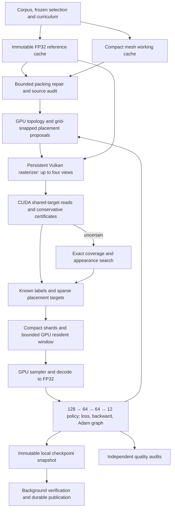

# Compact GPU learning pipeline

Local implementation based on `646eba5`, measured on the shared RTX 2080.
Packed Vulkan draw streams and compact training records are the defaults in
`blitz-neural-cycle`. Network arithmetic, visibility depth and interpolated
audit targets retain FP32 precision; the exact visual metric is unchanged.

**Storage improves substantially; a reliable 2× end-to-end speedup is not
established.** The full packed teacher curriculum now completes, including
the boulder. Two independent packed inference diagnostics still fail, so this
revision is not cleared for two-hour training. No remote resources were
started in this pass. Earlier remote evidence concerns earlier binaries.

## Architecture and ownership



One shared policy learns across meshes. Asset/category IDs only schedule
sampling and record provenance; they are not input features. Inference builds
features from a new mesh and uses saved weights to rank actions and propose
positions/normals, followed by visual checks. This supports train-on-many,
use-on-new-mesh operation. Three development assets and two diagnostics do
**not** prove generalization to 100 diverse models.

The renderer survives asset-local evaluators. Reference rasters own their
linear CUDA storage. Candidate surface views borrow Vulkan attachments until
the next draw and are not cached. External ownership barriers and timeline
semaphores join Vulkan and CUDA. Camera order, rejection and refinement remain
unchanged. Finite-incumbent queries draw one view: always drawing four wasted
work when the first view rejected. Resource pressure halves the view batch.

The hot update loop runs on GPU. Import/cache validation, rare initial packing
repair, serialization, checkpoint publication and scheduling still involve
CPU. Candidate audits retain small synchronous status readbacks. This is not
yet an entirely GPU-driven pipeline.

## Storage contracts

| Data | Representation | Contract |
|---|---|---|
| Working positions | 3 × UNORM16, 6 B/vertex | Fixed outward-rounded source bounds; flat axes supported |
| UV | 2 × UNORM16, 4 B/vertex | [-8,8]; larger values rejected |
| Normal / tangent | RGB10A2, 4 B each | Tangent sign in A; absent streams omitted |
| Color | RGBA8, 4 B/vertex | Exact imported bytes; absent stream omitted |
| Topology | u32 indices, u16 material IDs | Original source kept separately |
| v3 continuous features | 74 × 16-bit, 148 B/row | Bounded fields SNORM/UNORM; other fields IEEE half |
| v3 feature colors | 12 × u8, 12 B/row | Exact canonical RGB bytes |
| Feature flags / labels | u32 / u8 | Exact masks; unknown labels never become negatives |
| Conditions | 8 × FP32/state | Shared by that state's rows |
| Placement targets | Sparse SNORM16 triplets | Position [-1,1]; normal residuals [-2,2]; known groups only |
| Exceptional features | Sorted u32 slot + FP32 value | Out-of-range, half overflow and nonzero underflow preserved |

`BLZACT04` validates dimensions, domains, masks and exceptions; legacy
`BLZACT02/03` remain readable. The v2 schema uses 46 continuous 16-bit values
and 6 color bytes. IDs and progress remain exact. Compact shards upload
directly; GPU gather decodes FP32 activations without a CPU FP32 matrix.
Weights, gradients and Adam state stay FP32.

Checksummed `BLZMPK01` working meshes coexist with `BLZMREF1` references.
Reference versus working file sizes: bench 30,558 → 18,396 B; boulder
1,792,278 → 1,249,332 B; potato 66,454 → 45,220 B. These compare representations,
not the sum of both files. The working mesh currently decodes once on CPU and
uploads an editable FP32 state; direct packed mesh upload remains future
work. Draw packets are generated on GPU. Draw metadata is now 64 B including
four clip flags, versus the earlier 48 B.

Immutable resident pages use a stable root captured by the update graph.
Appending does not recapture unless maximum action count grows. At the dataset
budget, the cycle starts a new resident window and journals its first shard
for recovery. Disk shards remain. Sampling balances categories/assets/progress
within the active window, not all historic examples simultaneously.

## Packing failure and repair

The boulder's initial failure was a visibility change. At 128 px/4× sampling,
one unmatched appearance sample switched face 25643 → 25637. At [108,203],
depths were 0.4672611 and 0.4688192 and visible normals differed about 175°.
Changed coverage was only 0.0000122079. Position-only packing reproduced it.

Repair moved vertex 13592 by **one UNORM16 code in Y**, after nine trials.
All eight teacher views then passed: error 2.75443 under the unchanged 3 px
limit. Proposals stay on the fixed grid; outside-bound placements are rejected.
Coincident wedges move together, incident orientation/area is checked and
retained edits are re-audited. This bounded search is not a feasibility proof.
The failed first repair remains in the evidence.

The final packed curriculum generated **54 states and 12,288 updates**, with
all six teacher conditions passing. Overall `complete` is still false:
shelves and moon rock return `no_confirmed_chain` for both constant and learned
diagnostics. First reported confirmation failures occur at 181.019 px, limit
2 px, views 4 and 6. Coverage upper error is 0.957108 px; appearance has no
accepted witness within the limit (its infinite error serializes as null).
This means the bounded search did not deliver a confirmed chain, not that
no packed solution exists. No gate was relaxed and no FP32 draw fallback
was substituted. See [packed-final.json](evidence/compact-local/packed-final.json).

## Matched local measurements

Three alternating repeats: same six-condition curriculum, 54 states, 12,288
updates, batch 512, 24 checkpoints and both diagnostic rankings. All timing
variants use **FP32 draw geometry** to isolate pipeline/record changes from
packing repair and its quality failures. Baseline and optimized FP32 runs
produce byte-identical shards and final parameters. Compact inputs can change
later proposals and are a separate precision experiment.

| Variant | Median process wall time | Range |
|---|---:|---:|
| Baseline `646eba5`, FP32 records | 16.599 s | 15.095–17.639 s |
| Optimized, FP32 records | 10.884 s | 9.452–17.365 s |
| Optimized, compact records | 10.743 s | 10.281–16.120 s |

Observed median ratios: 1.53× and 1.55×. Desktop contention varied significantly,
including 99–100% GPU utilization and 3.2–7.6 GiB total memory use. Overlapping
ranges prevent treating these as isolated speedups. Earlier comparisons are
retained: unconditional four-view batching yielded only 1.09× for the FP32
control, and compact records were slower than optimized FP32. Do not select
only the fastest repeats. Commands, binary hashes and telemetry are in
[timing-final.json](evidence/compact-local/timing-final.json).

The storage A/B uses the same original 215 rows, identical sampled IDs and
2,048 FP32 optimizer updates:

| Measurement | FP32 records | Compact records |
|---|---:|---:|
| Shard bytes | 120,595 | 43,923 (**2.75× smaller**) |
| Resident dataset bytes | 86,431 | 42,979 (**2.01× smaller**) |
| Update time, single run | 0.4156 s | 0.4117 s |
| Final loss | 0.014023 | 0.012374 |

No meaningful optimizer speedup is established on this tiny dataset. Maximum
feature/target deltas: 0.00024045 / 0.00001523, with no exceptions in these
particular shards (tests cover exceptions). Gradients stay finite but weights
diverge, maximum delta 1.72. Both FP32-render diagnostic chains pass: shelves
[524,520,520] versus [524,516,516], moon rock [3304,3300,3300] versus
[3304,3302,3302]. Mixed outcomes are a precision smoke check, not a quality
score. See [storage-proof.json](evidence/compact-local/storage-proof.json).

## Current timing hierarchy

One instrumented current-binary cycle: compact records / FP32 draws, Nsight
Systems. Instrumentation and shared-GPU contention affect duration; use the
repeats above for process throughput. These wall phases are additive:

```text
Cycle body                                      12.812 s
├─ Teacher preparation                           6.697 s
│  ├─ Bench 32 px                                0.472 s
│  ├─ Potato 64 px                               0.522 s
│  ├─ Boulder 128 px                             1.223 s
│  ├─ Bench 128 px + predecessor                  1.580 s
│  ├─ Potato 128 px + predecessor                 0.949 s
│  └─ Boulder 64 px + predecessor                 1.951 s
├─ Training phases                               3.147 s
│  ├─ Append and initial trainer setup            0.053 s
│  ├─ Graph capture                              0.057 s
│  ├─ 12,288 updates                             2.939 s
│  ├─ Foreground checkpoint work                 0.079 s
│  └─ Other                                      0.019 s
├─ Quality audits                                2.551 s
│  ├─ Constant ranking                           1.123 s
│  └─ Learned ranking                            1.429 s
└─ Initialization / unassigned / final joining    0.417 s
```

GPU activity describes those same phases, **not additional time**:

```text
CUDA outside update graphs                       2.721 s / 101,574 launches
├─ Exact appearance                              1.331 s /   3,940
├─ Draw clipping                                 0.221 s /  10,812
├─ Predicate initialization                      0.208 s /   7,965
├─ Sparse appearance search                      0.164 s /   7,965
├─ Placement + validation                        0.165 s /   8,120
├─ Exact comparison initialization               0.080 s /   1,970
├─ Target unpacking                              0.074 s /   2,867
├─ Draw bounds + stream packing                  0.082 s /   7,940
└─ Other                                         0.396 s
Update graph kernels                             2.529 s / 516,096 launches
├─ Gather/decode                                 0.293 s
├─ Bias-gradient reductions                      0.330 s
└─ Matmul, loss, activation/backward, fills, Adam  1.906 s
Vulkan GPU submissions                           0.300 s /   6,189 submissions
```

The graph has **42 kernels/update**, about 206 µs summed GPU time/update here.
Vulkan creates one device (0.100 s). All kernel names/counts are in
[kernel-profile.json](evidence/compact-local/kernel-profile.json).

CUDA's 25,133 synchronous `cudaMemcpy` calls occupy 6.590 s of host API time,
while all device-to-host copies move only 14.10 MB in 0.0215 s of copy-engine
time. API durations include GPU waiting/contention; they are not 6.590 s of
bandwidth cost and cannot be added to kernel time. Candidate scheduling round
trips remain a major opportunity.

Checkpoint work overlaps: 24 publications / 5.87 MB; 0.013 s snapshots,
0.022 s serialization, 0.061 s verification, 1.027 s durable publication,
0.040 s foreground joining. One immutable snapshot is in flight. Local
readiness permits teacher/quality work before durable storage finishes.
Checksums, file/directory fsync and an atomic recovery journal protect the
last published checkpoint. Network-storage latency was not measured here.

## Conservative appearance certificates

Exact matching is skipped only when a directed-rounding upper bound is below
an already unavoidable coverage error. For normals let `m=min(|a|²,|b|²)` and
`d=|a-b|²`. Angle squared is bounded by `(d/m)/(1-d/(4m))` when `d/m<4`,
and globally by `pi²*d/(4m)`. Conservative bins use `1.1*d` for
`m>=.99,d<=.25`, `3*d` for other `m>=.99` cases, and `10*d` for `m>=.25`.
Other cases use the exact path. This avoids division/sqrt/acos in the
certificate and shares the symmetric center check. Metric and precision do
not change. Independent tests cover bin/length boundaries, degenerate normals,
overflow and near-threshold decisions.

## Larger selections and recovery

Supply a checksummed corpus with `split: development`, a frozen selection
containing its asset IDs, and a curriculum with conditions such as
`{"asset":"id","pixels":128,"previous_steps":0}`. The versioned shape is in
[resident-curriculum.json](resident-curriculum.json). Up to 4096 conditions:

```sh
nix develop .#neural -c build/neural/blitz-neural-cycle runs/neural/my-cycle \
  --corpus my-corpus.json --training-selection my-training.json \
  --curriculum my-curriculum.json --mesh-cache runs/neural/mesh-cache \
  --data-storage compact --dataset-mib 128 --gpu-memory-mib 2048 \
  --states 8 --updates 2048 --minutes 3 \
  --initialize policy.blzn --warmstart checkpoint.pt
```

This is a short pilot, not approval for long training before quality blockers
are resolved. Resume requires identical inputs, binary and contract hashes.
Unsupported packing produces a separate failure and no false negative labels.
Empty legal action sets are recorded; an entirely empty run cannot report
successful training. A 100-asset sampler fixture passes; 100 real models have
not been prepared or trained here.

## Validation and next steps

- Final neural build: 27/27 CTest contracts pass, including independent
  raster/predicate agreement, serial/batched/direct-target parity, compact
  CPU/GPU decoding, masks, codecs and bounded resident windows.
- CPU ASan/UBSan: 13/13 pass. CUDA memcheck: Vulkan, resident update and final
  predicate tests report zero errors. Vulkan synchronization validation has
  no errors; optional unused fragment-output warnings remain.
- Recovery kills inside an optimizer segment and compares resumed datasets
  and parameter payloads to uninterrupted execution. Checkpoint tests cover
  delayed and failed publication. Logs/results: [evidence/compact-local](evidence/compact-local).
- Torch emitted an AccumulateGrad stream warning in the multi-owner resident
  test. Memcheck was clean; the production-cycle trace did not emit it. The
  warning remains in the retained log.

Next work should target the large costs:

1. Resolve shelves/moon-rock chain failures using face/depth witnesses across
   search, source and predecessor checks. Deliver confirmed packed chains
   before long training without relaxing gates or silently changing precision.
2. Batch independent placement candidates and keep verdict/status data on GPU.
   Camera batching leaves tens of thousands of host round trips. Preserve
   deterministic candidate order and audit gates.
3. Fuse small-network backward/bias/activation and optimizer work where
   measured useful. Forty-two kernels/update leave launch and intermediate
   memory cost even with graph replay. Compare FP32 first.
4. Add tiled candidate lists or tighter spatial/normal bounds for exact
   appearance fallback. It remains the largest audit kernel. Rasterization
   is only 0.300 s of this trace, so vertex bandwidth alone cannot provide
   the requested large end-to-end boost.

Reproduce timing with `compact-profile.mjs FRESH_DIR MODEL CHECKPOINT 3`;
precision with `blitz-neural-cycle --compare-storage SHARD_DIR FRESH_DIR MODEL`;
recovery with `hardware-recovery.mjs FRESH_DIR`. Summarize an Nsight export with
`compact-trace.mjs TRACE.sqlite CYCLE_REPORT.json FRESH_REPORT.json`.
All experiments have `score: null`; none is a held-out release audit.
