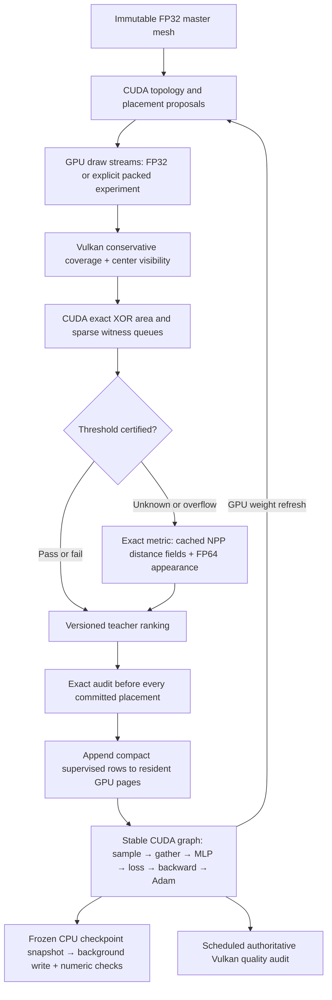

# Hardware rasterization and resident learning

Local RTX 2080, driver 595.71.05, CUDA 12.9, LibTorch 2.10/cu128.
The complete FP32 draw-control pipeline is **2.90× faster end to end** on the frozen local
learning pass. Three sequential repeats: legacy 38.61–40.55 s; new
13.57–14.25 s. Both paths start from optimizer step 224,768 and perform
54 teacher states, 12,288 updates, 24 checkpoints, and constant/learned audits
on the same two development assets. Settings, cameras, work budgets, and
visual limits are unchanged. Hardware raster semantics and teacher ordering
are versioned changes; training labels and final models can differ.

| Measured component | Legacy median | Vulkan FP32 median | Speedup |
|---|---:|---:|---:|
| Entire pass, including startup/teardown | 39.75 s | 13.73 s | 2.90× |
| Six teacher phases | 20.53 s | 7.61 s | 2.70× |
| Six training phases | 11.54 s | 2.33 s | 4.95× |
| Both quality diagnostics | 6.42 s | 2.82 s | 2.28× |
| Expensive bench teacher core, 256→128 px | 6.59 s | 1.16 s | 5.67× |

Independent medians need not add. The workstation was shared; all raw repeats,
GPU occupancy snapshots, binary/source hashes, settings and per-asset results
are in [comparison.json](evidence/hardware-local/comparison.json). These are
throughput measurements, not a quality score or a claim that more updates
produce better meshes. Unreduced levels remain visible in the quality rows.

## Architecture and timings



Representative median native run, including process startup and teardown:

```text
Full learning pass                                 13.731 s
├─ Six teacher phases                               7.493 s
│  ├─ Bench 32 px                         0.720 s  (core 0.483)
│  ├─ Sweet potato 64 px                  0.744 s  (core 0.537)
│  ├─ Boulder 128 px                      1.550 s  (core 1.305)
│  ├─ Bench 256→128 px                    1.474 s  (core 1.211)
│  ├─ Sweet potato 256→128 px             1.262 s  (core 0.980)
│  └─ Boulder 128→64 px                   1.744 s  (core 1.507)
├─ Training phases                                  2.330 s
│  ├─ 12,288 optimizer updates                       2.151 s (175 µs/update)
│  ├─ One graph capture                              0.055 s
│  ├─ Dataset append / initial optimizer restore    0.042 s
│  ├─ Foreground checkpoint preparation/checks       0.042 s
│  └─ Writer joins / refresh / bookkeeping           0.040 s
├─ Quality diagnostics                              2.932 s
│  ├─ Constant ranking                               1.591 s
│  └─ Learned ranking                                1.341 s
└─ Startup / model setup / teardown / remainder     0.975 s
```

The last resident dataset occupies **87,431 bytes**; the graph was captured
once across all six appends. Only supervised rows are stored. Float features
and targets retain FP32; bounded flags/labels are packed. The sampler keeps
category/asset/progress balancing and deterministic counter-based selection.
Ordinary phase transitions refresh policy weights device-to-device.

Sparse queries ask for witnesses within the unchanged threshold, rather than
computing a nearest match for every pixel. Coverage queues contain XOR pixels
and search the entire opposing mask, including unchanged pixels. Appearance
queues omit same-pixel pairs with a conservative, outward-rounded proof.
A warp searches each remaining pixel. Queue overflow, clipping, unproven
coverage, or unsupported radius uses the exact fallback. Bounds have their
own `AuditPredicate` type and are never exported as exact measurements.

NPP PBA supplies nearest-site integer coordinates, converted to exact squared
integer distances; its rounded floating distance output is not squared.
The fast path is limited to image sides 64–2897, where every squared pixel
distance fits exactly in FP32. Smaller/larger images retain the reference
transform. Empty masks are handled before NPP. Twenty-one deterministic
cases, including odd dimensions and the upper boundary, matched an independent
integer oracle with zero mismatches. Immutable reference fields are cached.

## Packed draw default

Separate GPU streams use the requested formats:

| Stream | Representation | Bytes/vertex |
|---|---|---:|
| Position | XYZ UNORM16 within mesh bounds | 6 |
| UV, when present | XY UNORM16 mapped to [-8,8] | 4 |
| Linear color, when present | RGBA8 | 4 |
| Normal | RGB10A2 SNORM, alpha zero | 4 |
| Tangent, when present | RGB10A2 SNORM, alpha canonical ±1 | 4 |

All attributes present: **52 → 22 bytes/vertex**. The sign of tangent alpha
is bit 31; canonical signed alpha encodes +1 as 01 and -1 as 11.
Position step is mesh extent/65,535 per axis; UV step is 16/65,535.
Out-of-range or nonfinite UVs are rejected. Degenerate bounds, zero/missing
normals, linear color bytes, sign encoding and immutable source data are tested.
Bounds contain 24 bytes of values; aligned shader metadata occupies 48 bytes.
Triangle indices remain uint32 to match the full mesh ID domain and CUDA state.

The measured bench has positions, normals and UVs: **21,664 → 9,478 bytes**
of draw vertices, a 56.25% reduction. Across four 128 px cameras, FP32 Vulkan
rendering (packing, interop and target conversion included) took 0.283–0.464 ms
versus 1.043–1.403 ms for CUDA. The hardware passes themselves took 21–29 µs.
Packed Vulkan took 0.313–0.432 ms: **no consistent additional speedup** over
FP32 Vulkan on this mesh. Packing adds work and the shader does not currently
consume UV/tangent data.

**Packed draw data is the Vulkan and resident-cycle default**, as requested.
`--vertex-storage fp32` explicitly selects the diagnostic control used for the
complete timing comparison above. Automatic storage resolves to FP32 for the
legacy CUDA renderer, which has no packed draw interface. A packed bench pilot
failed the unchanged visual gate and is retained as negative evidence; a packed
sweet-potato pilot completed. The packed full-cycle pilot completes bench 32 px
and sweet potato 64 px, then stops at boulder 128 px with no feasible queried
placement. It has no complete-cycle throughput result or quality score. A few edge pixels changed face ownership, producing up to ~90°
pixel-normal differences despite small numeric quantization. Original source
renders stay FP32, so storage error consumes the existing visual budget.
Master geometry, depth, render attributes and optimizer arithmetic remain FP32;
the exact metric retains its FP64 calculations. Current audits do not sample
textures/normal maps, so UV/tangent tests establish storage/frame contracts only.

## Remaining costs

The separate bench replay has 355.47 ms of CUDA kernel time (Vulkan draw time
is additional): predicate scan 88.89 ms, exact appearance 86.45 ms, target
conversion 52.98 ms, sparse appearance 50.80 ms, sparse coverage 4.79 ms.
The remainder includes geometry, draw preparation and distance fields. The
replay produced exactly the native run's teacher dataset.

The main remaining opportunities are view batching and reducing host waits,
fusing target conversion with predicate scanning, and reusing Vulkan device/
pipeline setup across teacher phases. `cudaMemcpy` API time was 818 ms across
6,157 calls; it includes waiting for preceding work and must not be added to
GPU kernel time. All teacher phase setup/remainder costs total 1.47 s in the
representative pass. The 59k-triangle boulder now has the slowest teacher core.

This implementation redraws all geometry into cleared targets. Dirty scissors,
per-tile certificate reuse, batched views and direct surface comparisons are
not implemented. Full redraw preserves hidden-surface correctness after removing
an occluder. The measured hardware draw is small; unmeasured complexity was not
used to claim a speedup. CPU code still schedules phases and transfers small
status summaries; geometry, rasterization, comparisons and updates run on GPU.

## Validation and use

Local: 26/26 CTest tests, 10/10 ASan/UBSan tests, CUDA memcheck for sparse
metrics/resident training/Vulkan interop, and Vulkan synchronization validation
with the Khronos layer confirmed active. Vulkan reports no errors; an unused
color-output warning is expected when the optional color target is absent.
A forced SIGKILL at update 512 resumed within its 2,048-update segment and
finished with identical dataset bytes and model parameters. A failed checkpoint
verification cannot replace the last valid recovery pointer. Snapshots occur
every 512 updates, with one bounded background writer.

Build and run one bounded full learning pass:

```sh
nix develop .#neural -c cmake -S . -B build/neural -G Ninja \
  -DCMAKE_BUILD_TYPE=Release -DBLITZ_CUDA=ON -DBLITZ_VULKAN=ON -DBLITZ_NEURAL_TRAIN=ON
nix develop .#neural -c cmake --build build/neural -j3
nix develop .#neural -c build/neural/blitz-neural-cycle RUN_DIRECTORY \
  --initialize MODEL.blzn --warmstart CHECKPOINT.pt --minutes 5
```

Run the same command/directory to resume a matching checkpoint. The binary,
dataset hashes, work configuration and source manifests are checked. Packed is the hardware default; use `--vertex-storage fp32` for the complete
control workload, or `--vertex-storage position16` to isolate position packing. The library/CLI selection is `NeuralOptions::raster_backend` /
`--raster-backend vulkan`; the legacy library default stays CUDA for compatibility.
Vulkan needs a graphics-capable NVIDIA device matching CUDA's UUID, Linux FD
external memory/semaphores, conservative rasterization and Vulkan 1.3 features.

Reproduce throughput and crash recovery with `hardware-profile.mjs` and
`hardware-recovery.mjs`. Raw evidence is under
[evidence/hardware-local](evidence/hardware-local/). The benchmark binary hash
is retained; subsequent edits only strengthen recovery configuration validation,
release an old autograd graph before capacity recapture, and reject an invalid
CUDA/packed option combination. The hot algorithm is unchanged.

Remote validation is a separate bounded job using the existing spending grant.
It runs graphics/interop tests, memory checks, a packed default cycle with
explicit visual-gate failure reporting, a complete FP32 control cycle, remote
replay and replay of the local checkpoint on the remote GPU. It never starts a new
two-hour training session. Remote results will be recorded after collection.
