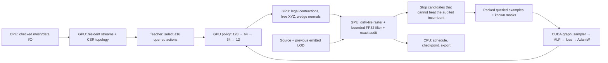
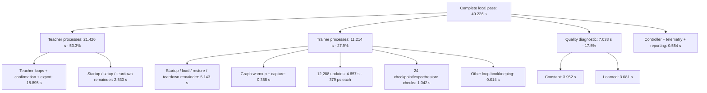

# GPU learning and free placement

This implementation targets fewer triangles within the configured source and
preceding-LOD visual limits. Audited views are not an all-view or global-optimum
guarantee. The learned policy is reusable across meshes; it is not a per-asset
vertex optimizer. Quality remains unproven until matched development comparisons.



## Current local FP32 pipeline timings (2026-09-30)

A fresh complete local pass on **RTX 2080 8 GiB**, driver 595.71.05,
revision `af30b55`, took **40.226 s**. Other applications occupied about
2.4 GiB before the pass. Production positions, raster attributes and training
remain FP32; existing FP64 arithmetic in the exact audit remains unchanged.

The pass generates eight target states in each of the six existing curriculum
conditions, plus six preceding-LOD states: **54 states and 12,288 updates**.
Each shard is followed by 2,048 updates, batch 512, carrying AdamW state from
the previous checkpoint. One constant/learned quality diagnostic follows all
six conditions. The native teacher workspace cap is 1,024 MiB. This is one
bounded timing pass, not a quality score, confidence interval, or measurement
of long-run time shares: the two-hour controller normally audits every 30
minutes and grows its per-condition state budget up to 64.

Open the **[expandable timing hierarchy](evidence/pipeline-timing-local/timings.html)**
for every recorded stage, per-asset details, and all 42 captured update kernels.
The [plain text tree](evidence/pipeline-timing-local/timing-tree.txt),
[raw cycle report](evidence/pipeline-timing-local/cycle-report.json),
[derived measurements](evidence/pipeline-timing-local/timings.json), and
[trace/input hashes](evidence/pipeline-timing-local/provenance.json) accompany it.



All values above are additive wall-time measurements or explicitly calculated
remainders. Setup includes loading, packing, transfers, CUDA initialization,
checkpoint restoration and teardown; those components were not separately
instrumented. Neither a remainder nor a host synchronization interval is a
measurement of idle GPU time.

| Teacher condition | Source triangles | States | Teacher core | Whole process |
| --- | ---: | ---: | ---: | ---: |
| Bench, 32px | 630 | 8 | 0.825 s | 1.991 s |
| Sweet potato, 64px | 2,042 | 8 | 0.906 s | 1.165 s |
| Boulder, 128px | 59,066 | 8 | 3.016 s | 3.294 s |
| Bench, 256px preceding → 128px target | 630 | 2 + 8 | 7.495 s | 7.761 s |
| Sweet potato, 256px preceding → 128px target | 2,042 | 2 + 8 | 2.655 s | 2.939 s |
| Boulder, 128px preceding → 64px target | 59,066 | 2 + 8 | 3.998 s | 4.275 s |

The slowest condition and final optimizer segment were replayed separately
under Nsight Systems (`cuda-graph-trace=node`). Both replayed teacher payload
and final parameter payload match the unprofiled run exactly. Their GPU
durations below are **separate measurements**, not additional children of the
40.226 s pass. No production timers or synchronization were added.

```text
Bench 256→128px teacher replay: 6,005.85 ms summed GPU kernel time
├─ Appearance / normal and attribute matching        2,289.54 ms  38.1%
├─ Coverage distance and summary                    2,199.06 ms  36.6%
│  ├─ General distance transform                    1,470.31 ms
│  ├─ Binary distance transform                       442.46 ms
│  ├─ Initialize / normal summary                     185.86 ms
│  ├─ Directed coverage reduction                      63.70 ms
│  └─ Transposes                                       36.74 ms
├─ Raster visibility and attributes                 1,150.65 ms  19.2%
├─ Sorting / scans / compaction                       170.23 ms   2.8%
├─ Projection / setup / bins / dirty tiles            163.03 ms   2.7%
└─ Placement / topology / features / policy            33.35 ms   0.6%

One optimizer update: 358.08 µs mean active GPU kernel time
├─ State sampling and packed feature gather            33.91 µs
│  ├─ Select states                                    3.10 µs
│  └─ Gather / unpack                                 30.82 µs
├─ Clear parameter gradients                           9.81 µs
├─ Forward MLP                                       105.43 µs
│  ├─ Layer 1: 128→64                                 46.34 µs
│  ├─ Layer 2: 64→64                                  37.10 µs
│  └─ Output: 64→12                                   22.00 µs
├─ Masked placement loss / output derivative           12.57 µs
├─ Backpropagation                                   178.37 µs
│  ├─ Output layer + hidden activation gradient        55.40 µs
│  ├─ Hidden layer + input activation gradient         68.52 µs
│  └─ First layer parameter gradients                  54.45 µs
├─ Gradient norm / clipping scale                      11.18 µs
├─ AdamW                                               5.35 µs
└─ Update counters                                     1.45 µs
```

The update trace contains 2,048 graph executions, each with 42 kernels. The
358.08 µs sum excludes memory operations and gaps. Across the six unprofiled
segments the measured update window averages **379.0 µs/update**, or
**2,639 updates/s**; the final segment alone is 370.3 µs/update. The 54-state
packed resident dataset occupies 334,368 bytes (326.5 KiB).

Appearance plus coverage account for **74.7%** of kernel time in the larger
teacher condition; rasterization alone is 19.2%. That is the main measured
GPU optimization target. Repeated trainer process/setup costs are also visible
at 5.143 s in this short pass. Transfers are small: the teacher trace moves
0.537 MB device-to-host in 7.243 ms and 0.213 MB host-to-device in 0.026 ms.
Its 9,193 blocking `cudaMemcpy` API calls occupy 6.608 s on the CPU largely
waiting for GPU work. Adding that wait to kernel time would double-count it;
it is not evidence that transferring half a megabyte takes six seconds.

All six shards and optimizer segments completed, including 24 verified
checkpoint exports/restorations. Both quality diagnostics completed with zero
resource/confirmation failures; unreduced fallback levels remain reported.
With more GPU memory available, **all 22 CTest checks now pass**, and the
CUDA audit memcheck finishes with **zero errors**, resolving the prior local
allocation-limited checks below. Logs are retained with the measurements.
No remote GPU spending or model promotion occurred in this timing run.

Reproduce the bounded cycle in a fresh directory using a compatible v3 model
and optimizer checkpoint (the recorded input step is 224,768):

```sh
nix develop .#neural -c node research/neural/pipeline-profile.mjs \
  runs/neural/pipeline-timing-repeat/cycle MODEL.blzn CHECKPOINT.pt START_STEP
```

The exact replay binary/arguments are in
[`profiles.json`](evidence/pipeline-timing-local/profiles.json). Capture each
sequentially with `nsys profile --trace=cuda --sample=none --cpuctxsw=none
--cuda-graph-trace=node`, export SQLite, and retain the four `nsys stats`
reports (`cuda_gpu_kern_sum`, `cuda_api_sum`, `cuda_gpu_mem_time_sum`,
`cuda_gpu_mem_size_sum`). The offline report generator
`node research/neural/pipeline-timing.mjs RUN_DIRECTORY FRESH_OUTPUT_DIRECTORY`
checks every tree total and replay hash and rejects an unexpected kernel
sequence before assigning the detailed update-stage labels.

## Local teacher acceleration and precision experiments (2026-09-30)

The completed remote cycle spent 96% of its time generating teacher examples.
This change attacks that work. Matched A/B/B/A runs against `3b1b95d` on the
local RTX 2080 produced **6.3–13.0× faster teacher generation**, with
**4.8–10.4× faster whole processes** across five completed settings. Every
completed comparison has byte-identical `actions.bin` payloads, including
features, labels and placement targets. These are bounded throughput diagnostics,
not a quality score or a promise of the same speedup on a remote GPU.

| Fixed teacher workload | Baseline median | Optimized median | Teacher speedup |
| --- | ---: | ---: | ---: |
| Bench, 32px, 8 states | 5.289 s | 0.836 s | 6.33× |
| Sweet potato, 64px, 8 states | 15.146 s | 1.265 s | 11.98× |
| Bench, 64px, 2 preceding + 6 target states | 23.489 s | 3.358 s | 6.99× |
| Sweet potato, 64px, 2 preceding + 6 target states | 31.547 s | 2.909 s | 10.84× |
| Sweet potato with trained policy, 32px, 2 + 6 states | 11.242 s | 0.866 s | 12.98× |

Each workload keeps seed 101, pool 4, the same cameras, refinement, proposals,
visual limits and 256 MiB native workspace cap. Preceding states use twice the
listed pixel size. The GPU is shared with desktop/Unity work; wall times include
startup and contention. Both versions failed the trained-policy case whose
preceding states were 128px because device memory was unavailable. Its partial
payloads differ and are explicitly excluded. Raw rows and hashes are in
[`matched.json`](evidence/teacher-acceleration/matched.json) and
[`policy32.json`](evidence/teacher-acceleration/policy32.json).

The largest improvement is exact incumbent pruning. Once a safe placement has
been audited, a later placement can stop after a fully refined view proves its
normalized error/changed-area margin cannot improve the current winner. The
original visual limit still controls refinement. Ties keep the earlier candidate;
pruned candidates remain unknown bounds, never negative training labels.
Identical placements reuse their measured outcome, and identical source/previous
checks share a result. Winning examples and final acceptance still use full
source and previous-LOD gates.

Trial rasters reuse 16×16 tiles only if no changed/removed face touched the tile
in either mesh. Position/normal bits, RGB, material, indices, bounds, primitive
order and stream presence participate in reuse. A directed-rounding FP32 upper
bound skips angular work only when its center-match cost cannot exceed the
coverage error floor. All uncertain pixels use the original FP64 metric.
Maximum normal diagnostics reduce a monotone dot-product encoding before one
shared `acos`, instead of evaluating `acos` at every pixel.

Teacher features and policy outputs now exist only for selected queries. At
59,066 faces, the former dense capacity for those two tensors was 198,461,760
bytes; 16 queried rows need 8,960 bytes. This is a capacity calculation for these
two tensors, not total mesh memory. Full policy ranking still computes all
required rows during LOD generation. The serial action lookup is also parallel.

| Audit target | Bytes/sample | Contract |
| --- | ---: | --- |
| Previous full `Pixel` | 36 | FP32 depth, normal, RGBA, material, flags |
| Production, no vertex colors | **16** | FP32 normal, exact material and flags; white is implicit |
| Production, vertex colors | **28** | Same 16-byte target plus separate FP32 RGB |
| Experimental SNORM16 normal + UNORM16 RGB | 16 | Quantized; research only |
| Experimental SNORM8 normal + UNORM8 RGB | 10 | Quantized; research only |

Depth is needed only while choosing the visible face. It now stays in the
raster thread's FP32 register and is never written to the audit target. Alpha
is implicit for opaque input. Missing colors are explicitly constant white on
both CPU and GPU. Thus the production target drops by **55.6%** without vertex
colors, or **22.2%** with colors, without quantizing the audited normal/RGB data.
Public reference raster readback retains the full `Pixel` representation.

The research probe also implements actual GPU UNORM16 XYZ storage inside each
mesh AABB: 6 bytes/vertex plus 24 bytes for bounds/scale, decoded directly by
projection and face setup. No FP32 position upload is retained in that path.
Mapped UNORM16 depth comparison is independently selectable. Neither option
silently changes the production gate or source/Reuse streams.

The overlapping-surface probe at 128px gives a concrete counterexample to making
either quantization unconditional: mapped depth16 changes 89,255 visible material
owners over five views, and position16 changes 62,398. They change 3 and 7
decisions respectively on the fixed 0.25/0.5/1/2/3/4px thresholds. Attribute16/8
preserve visibility and ownership in this probe, but each changes a decision at
an exact error boundary. Sweet-potato normal quantization at 64px changes the
source normals by at most 0.00149° (16-bit) or 0.3791° (8-bit); both change
boundary decisions. Quantization needs a bounded screening/refinement design
before it can replace hard audit data. Removing unused fields already saves
more bytes than depth16 alone, with no depth tie changes.

The final warmed 128px probes also cover both training assets. Depth16 fails a
3px comparison of the original source raster against its quantized raster in
one view on each asset, even when quantizing both sides of a candidate comparison
hides that change. Normal/RGB16 and normal/RGB8 pass that 3px drift check on these
assets but change exact-boundary decisions. Raw per-view drift, masks, ownership,
threshold decisions and isolated render timings are retained in the three
`precision-*-final.json` reports under
[`evidence/teacher-acceleration`](evidence/teacher-acceleration).

### Remaining measured bottlenecks

An Nsight comparison uses identical 32px sweet-potato work: two states, pool 2,
76 logical valid candidates, identical saved payload. GPU kernel totals are:

| Kernel group | Before | After |
| --- | ---: | ---: |
| Rasterization | 272.79 ms / 624 calls | 25.03 ms / 136 calls |
| Appearance | 105.28 ms / 2,464 calls | 8.04 ms / 224 calls |
| Radix-sort onesweep | 23.46 ms | 5.30 ms |
| Triangle setup | 13.02 ms | 2.95 ms |
| Action lookup | 33.37 ms / 86 calls | 0.049 ms / 6 calls |
| All GPU kernels | 509.20 ms | 53.73 ms |

Rasterization remains 46.6% of measured GPU kernel time; appearance is 15.0%,
radix-sort onesweep 9.9%, triangle setup 5.5%, and the general EDT pass 4.3%.
Native peak workspace falls from 25,591,556 to 13,815,636 bytes in this trace.
The optimized trace still makes 460 synchronous `cudaMemcpy` calls, accounting
for 89.63 ms of CUDA API wall time, and 4,714 kernel launches. API wall time
includes waiting for GPU work and must not be added to kernel time. Batching
view/candidate orchestration and keeping status on-device are the next large
opportunities. Full FP64 raster arithmetic and variable tile sorting remain.

The numerical filter uses CUDA's directed-rounding operations, with the
original double path for uncertain results; it does not enable fast math.
The relevant numerical references are the
[CUDA floating-point guide](https://docs.nvidia.com/cuda/archive/12.2.0/floating-point/index.html)
and [single-precision intrinsic reference](https://docs.nvidia.com/cuda/cuda-math-api/cuda_math_api/group__CUDA__MATH__SINGLE.html).

Reproduce teacher comparisons with `teacher-profile.mjs BASELINE OPTIMIZED
FRESH_OUTPUT [MODEL] [CASE]` inside `nix develop .#neural`. Reproduce precision
checks with `blitz-neural-precision-profile ASSET|overlaps FRESH_JSON [PIXELS]`.
Precision timing includes a warmup and excludes packing, upload and readback;
it is not an end-to-end speed claim. These experiments use development/training
identities and a deterministic fixture; no held-out data or new rental is used.

### Validation and limits of this evidence

The final binaries reproduce all five completed reference payloads again after
the buffer changes; see [`final-parity.json`](evidence/teacher-acceleration/final-parity.json).
The CUDA-enabled build passes 21/22 CTest cases. The remaining, unchanged
optimizer-update test fails with CUDA allocation exhaustion, including a
standalone retry. The CPU ASan/UBSan build passes all 9 tests. Compute Sanitizer
reports zero errors for GPU action contracts, including tile reuse and pruning.
The broader CUDA audit test finishes its assertions but memcheck reports seven
allocation/API errors under contention and no invalid-access reports; this is
not recorded as a clean sanitizer pass. All logs are retained in the evidence
directory.

Both development smoke assets finish with passing source/previous gates and zero
CPU/GPU confirmation disagreements at 64→32px on the optimized build. The rock
requires an isolated retry after an allocation failure in the combined run.
Shelves match the baseline output hash. Baseline rock runs suffer resource
failures and produce different outputs, so they do not establish a quality
comparison. The frozen 256→128px smoke was attempted on both binaries and also
failed; raw rows retain device-ordinal/allocation failures rather than treating
fallbacks as successful reductions. A sanitizer diagnostic confirms device
allocation exhaustion in that workload. These runs are in
[`smoke-small.json`](evidence/teacher-acceleration/smoke-small.json) and
[`smoke-attempts.json`](evidence/teacher-acceleration/smoke-attempts.json).

The shared 8 GiB display GPU was typically already using 7.3–7.7 GiB. No other
application was interrupted. The measured teacher speedups and completed
precision probes stand independently of the incomplete larger smoke. This
revision has not been validated on a remote GPU or used for another long
training run; the remote results below describe the preceding implementation.

## Data contract

The policy needs local geometry/connectivity, attributes and seam/boundary flags,
requested pixel size, visual limits and target reduction. Training additionally
needs queried outcomes, independent source/adjacent known masks, and one audited
joint placement target. Unqueried results are not failures. Global source IDs,
file metadata, paths and full rendered images are not network inputs.

| Data | Resident representation |
| --- | --- |
| Endpoint policy v2 | 80 inputs, 3 outputs, 9,539 FP32 parameters / 38,156 bytes |
| Free-placement policy v3 | 128 inputs, 12 outputs, 13,196 FP32 parameters / 52,784 bytes |
| v2 action | 52 FP32 values + 18 bits in a uint32 + one label byte |
| v3 action | 86 FP32 values + 32 flag bits + one label byte + 9 masked FP32 targets |
| Per state | 8 shared FP32 conditions; sampler hierarchy/ranges use uint32 |
| Geometry | Contiguous streams, uint32 IDs/indices, uint16 material IDs, byte flags |

Duplicate feature channels are reconstructed exactly. Continuous features and
optimizer state remain FP32; there is no lossy quantization. The fixed graph uses
16 action slots per sampled state and masks padding. This trades some padding
for stable graph shapes; compact variable-length rows are a possible later
memory optimization, not the current bottleneck. CPU shards retain versioned,
checksummed raw examples for replay; only compact data is uploaded for updates.

V3 predicts rank/source-pass/adjacent-pass logits, three midpoint-relative XYZ
coordinates bounded to one edge length per axis, and two independent normal
residuals. This allows movement off the edge segment. The hard evaluator never
uses predicted pass logits as permission to accept a candidate. Geometric wedge
IDs move together while their normal/UV/color/material correspondence stays
separate. UV/color/tangent transport projects to immutable incident source
triangles in the same chart. Missing normal streams retain flat shading.
Reuse output still preserves source IDs and attribute bytes. V1/v2 model readers
remain available; the old endpoint proof tool explicitly requires v2.

## Execution and ownership

The captured optimizer has persistent input, gradient, moment and control buffers.
A counter sampler selects category → asset → nonempty progress bin → state on the
GPU with unbiased bounded draws. Device loss, clipping, AdamW, step and failure
latch evolve inside the graph. Capture warmup is rolled back. Nonfinite updates
freeze parameters/moments and retain forensic inputs. Health is read once per
128 updates; checkpoints are verified every 512. Exact resume copies into stable
storage. `--warmstart CHECKPOINT` carries parameters, moments and counter into a
new checked dataset contract; `--initialize MODEL` explicitly starts new moments.

Mesh streams, adjacency, legality, features, scores, sorting, batch selection,
trial geometry and commits live on the GPU. Strided input streams transfer
directly without a temporary CPU packing array. Full mesh downloads occur at
output/reference export boundaries. Resident topology is reused between chain
proposals. Render caches use exact owned host keys or device owner/revision keys;
optional cache allocation pressure retries the same audit after eviction.
Generation/teacher topology, inference and audit allocations share a workspace
budget, including retained pooled capacity. CUDA context/cuBLAS allocations and
LibTorch allocations are outside the native workspace cap.

The CPU still orchestrates views, supersample refinement, variable tile storage,
proposal acceptance and curriculum stages. These are not one fully captured
mesh/audit graph. Raster, distance, appearance and optimizer calculations are GPU
kernels. Audit transfer/allocation counters cover the evaluator; the shared peak
covers native generation workspaces. No reduced-precision evaluator was added.

## Local evidence before rental

Base revision: `76c102b`; shared RTX 2080, CUDA 12.9, LibTorch 2.10 cu128, FP32
training. Raw measurements and checks are under `evidence/gpu-refactor-local`;
large traces and executables remain in `runs/neural/gpu-refactor`.

| Work | Measurement | Interpretation |
| --- | --- | --- |
| Frozen 236-state endpoint data | 811,840 resident bytes vs 1,215,872 dense feature/label/mask bytes | 33.2% less, exact reconstructed features |
| 1,024 updates, captured | median update window 0.549 s; complete 0.711 s + 0.057 s capture | Three repetitions; startup/checkpoints separate |
| 1,024 updates, fused eager | median update window 0.670 s | Captured 1.22× faster; all weight payloads identical |
| Original trainer, earlier three repeats | median complete 3.615 s | About 4.7× versus captured including capture; shared-GPU, different sampler, not convergence evidence |
| 3,042-triangle topology, 128 accepted contractions | CPU 82.7–87.3 ms; GPU 13.0–14.6 ms | Identical indices/work counts; excludes setup/audits |
| Resident topology setup | 287 ms, cold | Amortized across proposals, not hidden in steady-state comparison |
| Eight small candidate audits | 96 → 54 rasterizations, 42 reference hits | Exact metrics; cached timing 41–220 ms vs uncached 64–67 ms is noisy |
| Two development meshes, 128px tail, CPU/GPU comparison | 5.96 s total, zero disagreements/resources/nonfinite failures | Smoke settings; one unreduced fallback, no SCORE |

The successful 512-update Nsight trace has 512 graph replays. Between first and
last replay it has zero host-to-device copies, zero allocations and three
64-byte device-to-host health copies/synchronizations (the fourth health read is
after the last replay). This removes the former per-update sampling/optimizer
host traffic. The original trace contained 95,325 kernels and 1,627 stream
synchronizations including startup/checkpoint work. Graph-level tracing does not
count internal kernels, so these are not compared as equivalent kernel counts.
An earlier trace failed because other workstation processes exhausted VRAM; that
failed run is retained and excluded from timing results.

In the development smoke, GPU audits consumed 3.79 s while policy ranking took
0.020 s. Historical full-view evidence similarly spent 539/554 s in audits.
The remaining priorities are candidate audit/raster work, FP64 appearance math,
view/refinement launch overhead and teacher search—not a wider policy. No claim
of Blackwell speed or learning improvement is made from these local numbers.

Contract checks cover masked losses/gradients, evolving AdamW, failure freeze,
bit-exact dense/compact updates, interrupted continuation, optimizer carry-forward,
CPU/GPU topology/metrics, seam normals, nonfinite placement, strided input,
shared allocation lifetimes, cancellation and immutable input. Local CPU
ASan/UBSan passed all nine tests; CUDA memcheck and neural CTest results are saved
with the evidence. Native/FP64 export tolerance remains 2e-4.

## Approved remote experiment

Remote validation of revision `1b7bcfb` passed on the full Blackwell device:
all 22 CTests, CUDA memcheck, exact eager/captured weights, exact checkpoint and
curriculum continuation, cross-GPU replay, and the two-asset development smoke.
The saved-input replay matched native outputs exactly; FP64 maximum difference
was 8.61e-7. Evidence is in `evidence/gpu-refactor-remote`.

| Remote matched work | Measured time |
| --- | --- |
| 1,024 updates, captured / eager (median device window) | 0.126 / 0.429 s; 3.42× |
| Captured checkpoint/verification overhead | About 0.28 s per 1,024 updates, plus 0.086 s capture |
| 3,042-triangle topology CPU / GPU (median) | 50.0 / 11.8 ms; 4.23× |
| Eight candidate audits, uncached / cached | 54–58 / 32.6–32.8 ms; exact metrics, 96 / 54 rasters |

The two-hour cycle completed on 2026-09-29, from 20:09:04 to 22:08:39 UTC
(22:09 to 00:08 CEST). Its measured active duration was 7,175.576 seconds; the
final audit and checkpoint completed before the two-hour deadline. It performed
223,232 new optimizer updates over 3,875 states: 99 accepted refreshes plus the
three-state validation seed. One incomplete refresh was excluded. The final
checkpoint is step 224,768, including 1,536 preflight updates. All 104 training
segments completed with finite values, exact native exports and maximum FP64
export difference 7.19e-5, below the unchanged 2e-4 tolerance.

The final model does **not** establish useful reduction quality. The fixed,
bounded development diagnostic produced these 128px outputs:

| Asset | Source triangles | Constant ranking | Learned ranking | Learned source error / limit |
| --- | ---: | ---: | ---: | ---: |
| Painted wooden shelves | 524 | 522 | 516 | 0.707 / 3 px |
| Moon rock 02 | 3,304 | 3,296 | 3,296 | 2.594 / 3 px |

Both final learned outputs passed the configured source and preceding-LOD gates.
Their reductions are only 1.53% and 0.24%. Across both non-source LODs, learned
ranking improves shelves but worsens the rock's mean triangle ratio. The
constant arm shares the current checkpoint's placement outputs, so it isolates
ranking within each audit; it is not a fixed pre-training model baseline.

| Learned checkpoint | Shelves at 128px | Rock at 128px |
| --- | ---: | ---: |
| Preflight | 504 | 3,296 |
| About 30 minutes | 524 (unreduced fallback) | 3,270 |
| About 60 minutes | 520 | 3,232 |
| About 90 minutes | 520 | 3,256 |
| Final | 516 | 3,296 |

The final checkpoint regresses from earlier checkpoints on each asset. These are
two development assets, one seed, bounded proposal work and 16 audit views; they
do not establish a full-protocol score, default-quality performance, held-out
generalization or the achievable reduction ceiling. No checkpoint is promoted
as a quality winner from this screening.

The completed cycle exposes the remaining bottleneck:

| Work during the cycle | Measured time |
| --- | ---: |
| Teacher generation and its visual audits, including excluded refresh | 6,894.45 s (96.08% of the cycle) |
| Trainer execution, excluding graph capture | 93.59 s |
| Optimizer updates, included in trainer execution | 37.77 s |
| Checkpoint/export verification, included in trainer execution | 50.41 s |
| Graph capture | 9.68 s |

The remaining time includes process startup, data loading/transfers, scheduled
quality audits and orchestration. One-second telemetry averaged 94.59% GPU
utilization across the cycle and peaked at 2,804 MiB allocated GPU memory; the
packed final dataset occupied 23,994,000 bytes. The optimizer is fast, but further
optimizer-only speedups have little impact on the full cycle. Teacher candidate
auditing and quality retention are the next priorities before another long run.

The checksummed archive, final model and resumable optimizer checkpoint were
collected under `runs/neural/runpod-gpu-refactor-01`. The GPU was terminated at
22:09:05 UTC, then persistent storage was deleted after verified collection.
A live API check on 2026-09-30 confirmed that both resources were absent. The
conservative rental ledger is **$5.3084 of the $8 additional grant**; this uses
the rate cap and is not a final provider invoice. Derived measurements, artifact
hashes and all checkpoint audit rows are retained in
[`learning-review.json`](evidence/gpu-refactor-remote/learning-review.json).

The user authorized **up to $8 additional**, covering validation and a **two-hour
full learning cycle**, including new examples, updates and quality audits. The
new grant is anchored at the reconciled conservative $11.25963675 ledger, not at
the old cap. The bounded Blackwell profile allows 20 minutes setup, 130 minutes
for validation plus learning, and 10 minutes collection. At the maximum approved
$2.50/GPU-hour plus $0.01/hour storage allowance, the 160-minute bound costs
$6.6934, with a further $1 reserve inside the $8 grant. Current quote is checked
again before creation; all retries consume the same cumulative grant.

One immutable source bundle is deployed. Independent local services control the
rental and deadline. Results are collected and checksum verified before deleting
persistent storage. Validation runs CTest, GPU memcheck, matching eager/captured
benchmarks, cross-GPU saved-input replay, GPU teacher generation, exact optimizer
continuation and a two-asset development smoke. A measured `ARCHITECTURE.md` is
written remotely **before** starting the learning clock. Failure stops the run.
The full two-hour window must still fit; it is never silently shortened.

The first cycle fixes seed 101, three training-only identities, 32/64/128px
conditions and preceding LOD examples. It refreshes labels with the current
policy plus explicit teacher candidates, carries AdamW across dataset refreshes,
and compares learned versus constant ranking on the same development diagnostic
near 30/60/90 minutes and at the end. Shard sizes adapt only to measured time
within declared bounds; incomplete shards remain visible and are excluded from
training. The final audited model is retained. This is initial screening, not a
three-seed full-protocol quality result or held-out release audit.

```sh
BLITZ_RUNPOD_PROFILE=gpu-refactor node research/neural/runpod.mjs prepare-gpu-refactor RUN
BLITZ_RUNPOD_PROFILE=gpu-refactor node research/neural/runpod.mjs launch RUN
BLITZ_RUNPOD_PROFILE=gpu-refactor node research/neural/runpod.mjs status RUN
```
