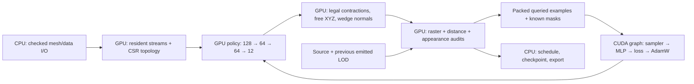

# GPU learning and free placement

This implementation targets fewer triangles within the configured source and
preceding-LOD visual limits. Audited views are not an all-view or global-optimum
guarantee. The learned policy is reusable across meshes; it is not a per-asset
vertex optimizer. Quality remains unproven until matched development comparisons.



## Data contract

The policy needs local geometry/connectivity, attributes and seam/boundary flags,
requested pixel size, visual limits and target reduction. Training additionally
needs queried outcomes, independent source/adjacent known masks, and one audited
joint placement target. Unqueried results are not failures. Global source IDs,
file metadata, paths and full rendered images are not network inputs.

| Data | Resident representation |
| --- | --- |
| Endpoint policy v2 | 80 inputs, 3 outputs, 9,539 FP32 parameters / 38,156 bytes |
| Free-placement policy v3 | 128 inputs, 12 outputs, 13,196 FP32 parameters / 52,784 bytes |
| v2 action | 52 FP32 values + 18 bits in a uint32 + one label byte |
| v3 action | 86 FP32 values + 32 flag bits + one label byte + 9 masked FP32 targets |
| Per state | 8 shared FP32 conditions; sampler hierarchy/ranges use uint32 |
| Geometry | Contiguous streams, uint32 IDs/indices, uint16 material IDs, byte flags |

Duplicate feature channels are reconstructed exactly. Continuous features and
optimizer state remain FP32; there is no lossy quantization. The fixed graph uses
16 action slots per sampled state and masks padding. This trades some padding
for stable graph shapes; compact variable-length rows are a possible later
memory optimization, not the current bottleneck. CPU shards retain versioned,
checksummed raw examples for replay; only compact data is uploaded for updates.

V3 predicts rank/source-pass/adjacent-pass logits, three midpoint-relative XYZ
coordinates bounded to one edge length per axis, and two independent normal
residuals. This allows movement off the edge segment. The hard evaluator never
uses predicted pass logits as permission to accept a candidate. Geometric wedge
IDs move together while their normal/UV/color/material correspondence stays
separate. UV/color/tangent transport projects to immutable incident source
triangles in the same chart. Missing normal streams retain flat shading.
Reuse output still preserves source IDs and attribute bytes. V1/v2 model readers
remain available; the old endpoint proof tool explicitly requires v2.

## Execution and ownership

The captured optimizer has persistent input, gradient, moment and control buffers.
A counter sampler selects category → asset → nonempty progress bin → state on the
GPU with unbiased bounded draws. Device loss, clipping, AdamW, step and failure
latch evolve inside the graph. Capture warmup is rolled back. Nonfinite updates
freeze parameters/moments and retain forensic inputs. Health is read once per
128 updates; checkpoints are verified every 512. Exact resume copies into stable
storage. `--warmstart CHECKPOINT` carries parameters, moments and counter into a
new checked dataset contract; `--initialize MODEL` explicitly starts new moments.

Mesh streams, adjacency, legality, features, scores, sorting, batch selection,
trial geometry and commits live on the GPU. Strided input streams transfer
directly without a temporary CPU packing array. Full mesh downloads occur at
output/reference export boundaries. Resident topology is reused between chain
proposals. Render caches use exact owned host keys or device owner/revision keys;
optional cache allocation pressure retries the same audit after eviction.
Generation/teacher topology, inference and audit allocations share a workspace
budget, including retained pooled capacity. CUDA context/cuBLAS allocations and
LibTorch allocations are outside the native workspace cap.

The CPU still orchestrates views, supersample refinement, variable tile storage,
proposal acceptance and curriculum stages. These are not one fully captured
mesh/audit graph. Raster, distance, appearance and optimizer calculations are GPU
kernels. Audit transfer/allocation counters cover the evaluator; the shared peak
covers native generation workspaces. No reduced-precision evaluator was added.

## Local evidence before rental

Base revision: `76c102b`; shared RTX 2080, CUDA 12.9, LibTorch 2.10 cu128, FP32
training. Raw measurements and checks are under `evidence/gpu-refactor-local`;
large traces and executables remain in `runs/neural/gpu-refactor`.

| Work | Measurement | Interpretation |
| --- | --- | --- |
| Frozen 236-state endpoint data | 811,840 resident bytes vs 1,215,872 dense feature/label/mask bytes | 33.2% less, exact reconstructed features |
| 1,024 updates, captured | median update window 0.549 s; complete 0.711 s + 0.057 s capture | Three repetitions; startup/checkpoints separate |
| 1,024 updates, fused eager | median update window 0.670 s | Captured 1.22× faster; all weight payloads identical |
| Original trainer, earlier three repeats | median complete 3.615 s | About 4.7× versus captured including capture; shared-GPU, different sampler, not convergence evidence |
| 3,042-triangle topology, 128 accepted contractions | CPU 82.7–87.3 ms; GPU 13.0–14.6 ms | Identical indices/work counts; excludes setup/audits |
| Resident topology setup | 287 ms, cold | Amortized across proposals, not hidden in steady-state comparison |
| Eight small candidate audits | 96 → 54 rasterizations, 42 reference hits | Exact metrics; cached timing 41–220 ms vs uncached 64–67 ms is noisy |
| Two development meshes, 128px tail, CPU/GPU comparison | 5.96 s total, zero disagreements/resources/nonfinite failures | Smoke settings; one unreduced fallback, no SCORE |

The successful 512-update Nsight trace has 512 graph replays. Between first and
last replay it has zero host-to-device copies, zero allocations and three
64-byte device-to-host health copies/synchronizations (the fourth health read is
after the last replay). This removes the former per-update sampling/optimizer
host traffic. The original trace contained 95,325 kernels and 1,627 stream
synchronizations including startup/checkpoint work. Graph-level tracing does not
count internal kernels, so these are not compared as equivalent kernel counts.
An earlier trace failed because other workstation processes exhausted VRAM; that
failed run is retained and excluded from timing results.

In the development smoke, GPU audits consumed 3.79 s while policy ranking took
0.020 s. Historical full-view evidence similarly spent 539/554 s in audits.
The remaining priorities are candidate audit/raster work, FP64 appearance math,
view/refinement launch overhead and teacher search—not a wider policy. No claim
of Blackwell speed or learning improvement is made from these local numbers.

Contract checks cover masked losses/gradients, evolving AdamW, failure freeze,
bit-exact dense/compact updates, interrupted continuation, optimizer carry-forward,
CPU/GPU topology/metrics, seam normals, nonfinite placement, strided input,
shared allocation lifetimes, cancellation and immutable input. Local CPU
ASan/UBSan passed all nine tests; CUDA memcheck and neural CTest results are saved
with the evidence. Native/FP64 export tolerance remains 2e-4.

## Approved remote experiment

Remote validation of revision `1b7bcfb` passed on the full Blackwell device:
all 22 CTests, CUDA memcheck, exact eager/captured weights, exact checkpoint and
curriculum continuation, cross-GPU replay, and the two-asset development smoke.
The saved-input replay matched native outputs exactly; FP64 maximum difference
was 8.61e-7. Evidence is in `evidence/gpu-refactor-remote`.

| Remote matched work | Measured time |
| --- | --- |
| 1,024 updates, captured / eager (median device window) | 0.126 / 0.429 s; 3.42× |
| Captured checkpoint/verification overhead | About 0.28 s per 1,024 updates, plus 0.086 s capture |
| 3,042-triangle topology CPU / GPU (median) | 50.0 / 11.8 ms; 4.23× |
| Eight candidate audits, uncached / cached | 54–58 / 32.6–32.8 ms; exact metrics, 96 / 54 rasters |

The two-hour learning window began at 20:09:04 UTC on 2026-09-29 after the
measured architecture report was written. Its result is pending; validation and
throughput do not establish learned reduction quality.

The user authorized **up to $8 additional**, covering validation and a **two-hour
full learning cycle**, including new examples, updates and quality audits. The
new grant is anchored at the reconciled conservative $11.25963675 ledger, not at
the old cap. The bounded Blackwell profile allows 20 minutes setup, 130 minutes
for validation plus learning, and 10 minutes collection. At the maximum approved
$2.50/GPU-hour plus $0.01/hour storage allowance, the 160-minute bound costs
$6.6934, with a further $1 reserve inside the $8 grant. Current quote is checked
again before creation; all retries consume the same cumulative grant.

One immutable source bundle is deployed. Independent local services control the
rental and deadline. Results are collected and checksum verified before deleting
persistent storage. Validation runs CTest, GPU memcheck, matching eager/captured
benchmarks, cross-GPU saved-input replay, GPU teacher generation, exact optimizer
continuation and a two-asset development smoke. A measured `ARCHITECTURE.md` is
written remotely **before** starting the learning clock. Failure stops the run.
The full two-hour window must still fit; it is never silently shortened.

The first cycle fixes seed 101, three training-only identities, 32/64/128px
conditions and preceding LOD examples. It refreshes labels with the current
policy plus explicit teacher candidates, carries AdamW across dataset refreshes,
and compares learned versus constant ranking on the same development diagnostic
near 30/60/90 minutes and at the end. Shard sizes adapt only to measured time
within declared bounds; incomplete shards remain visible and are excluded from
training. The final audited model is retained. This is initial screening, not a
three-seed full-protocol quality result or held-out release audit.

```sh
BLITZ_RUNPOD_PROFILE=gpu-refactor node research/neural/runpod.mjs prepare-gpu-refactor RUN
BLITZ_RUNPOD_PROFILE=gpu-refactor node research/neural/runpod.mjs launch RUN
BLITZ_RUNPOD_PROFILE=gpu-refactor node research/neural/runpod.mjs status RUN
```
