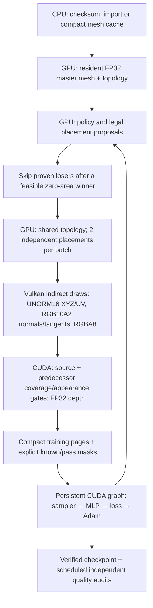

# Prepared learning pipeline — 2026-09-30

Implementation and local validation are complete. **The two-hour campaign has
not been launched. Full packed training is not ready:** the moon-rock inference
fixture still fails its unchanged visual gate, and the larger frozen preparation
pilot contains visible failures. Remote validation is being prepared separately.

The largest new gain comes from doing fewer queries. For one edge, every legal
placement has the same triangle count; coverage-area error is nonnegative and
stable ties retain the first winner. After a feasible zero-area winner, later
placements cannot improve the teacher's choice. They are skipped without
changing retained labels or the scoring rule. Independent placements that still
need comparison share topology and GPU live counts; Vulkan consumes an indirect
draw command. Candidate results are consumed in their original serial order.

Packing remains the default for draw streams and the mesh cache. Master editing
positions, neural arithmetic and depth remain FP32. Import, failure diagnostics,
checkpoint I/O and outer scheduling remain on the CPU. This is sampled-view
optimization, not a guarantee of a global optimum or correctness from every view.

## Local timings

Five alternating runs on the shared RTX 2080; 54 states and 12,288 updates/run,
batch 512, compact examples, identical initial model/checkpoint. These are
**FP32 draw controls**, separating scheduling gains from packed visual failures.
The timing curriculum caps predecessor preparation at 128px because the original
256px case repeatedly exhausted the memory left by other workstation programs.
Quality thresholds and final shelves/moon-rock inference audits were unchanged.
Failures from the larger timing attempts remain under `runs/neural/prepared-pipeline`.

| Variant | Teacher | Updates | Whole cycle |
|---|---:|---:|---:|
| Previous query loop, serial | 4.457 s | 2.291 s | 8.820 s |
| Skip proven losers, serial | 2.091 s | 2.306 s | 6.428 s |
| Skip proven losers, batch 2 — default cycle | 1.931 s | 2.280 s | 6.256 s |
| Batch 2 + optional native FP32 MLP | 1.967 s | 2.022 s | 6.157 s |

Each cell is a median, so columns are not additive. Teacher time improves **2.31×**;
total wall time falls **29.1%**. Queries fall **4,375 → 549 (87.5%)**. All 15 runs
using the reference optimizer retain byte-identical training shards and final
model parameters. The native backend has independent forward/gradient/moment
checks and exact same-backend checkpoint continuation; cross-backend bit identity
is not claimed. Its roughly 12% update-time gain misses the 20% target and gives
only 1.6% more total-cycle improvement here, so it remains an explicit option.
Batch 4 was slower and had higher memory pressure; it is available for profiling.

A representative default run splits into teacher preparation (~1.93 s), training
including capture/checkpoints (~2.41 s), and final quality audits (~1.56 s).
Detailed per-asset, per-phase, capture, checkpoint, transfer and allocation records
are in [the raw comparison](evidence/prepared-local/timings.json). Final quality
checking and optimizer execution now consume more time than teacher preparation.

## Correctness and preparation

- Repaired packed baselines now remain owned chain candidates. The shelves
  constant-control chain passes at **524 → 524 → 522 triangles**. A deterministic
  test protects equal-topology fallback retention.
- Failure replays record the original source, exact bounds/domain source, actual
  raster/storage modes, cameras and the failed stage, including exceptions during
  baseline preparation. Legacy replay semantics stay CUDA/FP32.
- Grid repair is bounded to 256 legal trials, including a small two-edit beam and
  coherent face edits. Every accepted result receives unchanged full gates.
  Moon rock still has two unmatched grazing-face pixels, with nearly opposite
  shading normals after visibility changes. Wider edits did not solve it. This
  remains a representation failure, not a negative training label.
- Mesh render revisions remain unique across resets and new trajectories. Optional
  raster targets are reclaimed on memory retries and when much larger than the
  next request; stale targets no longer needlessly consume scarce VRAM.
- The native v3 MLP uses FP32 cuBLASLt bias/ReLU epilogues, overwrites gradients,
  and retains the existing loss, finite checks and Adam contract. Algorithm IDs
  and epilogue availability are recorded. Reference training remains available.
- The artificial million-update ceiling is removed. Checked uint32 arithmetic
  and a device guard prevent wraparound before changing parameters or moments.
- A duration run persists absolute deadlines across resume, stops new work after
  110 minutes, and reserves 10 minutes for checkpoint publication and a final
  audit of the latest model. The cloud entrypoint uses one persistent cycle
  process. [The prepared preset](prepared-pilot/run.json) is unexecuted.
- Twelve development assets were frozen using metadata only: three distinct
  source groups per category. All 48 conditions were attempted, with **zero
  optimizer updates**. The initial 512 MiB local pilot passed 39; the other nine
  include representation failures, exhausted search, final audit failures and
  memory limits. No failed asset was replaced. See
  [the complete initial pilot](evidence/prepared-local/pilot12-initial.json).

Local checks: 28/28 CTests; 13/13 ASan/UBSan CTests; focused Vulkan, GPU-action,
replay and resident tests after the final logic changes; CUDA memcheck reports
zero errors for reference and native resident update contracts. Tests cover
candidate batches 1/2/4, invalid placements, cutoff pruning, source immutability,
checkpoint freeze/restore, NaN rejection, counters above one million and overflow.

## Readiness

Do not start the long campaign yet. Resolve the packed visual failures first,
then rerun all frozen conditions on the isolated target GPU. Keep the same visual
contract unless a metric change is explicitly chosen. Further performance work
should target full appearance/coverage audits and the small FP32 GEMMs; additional
candidate batching alone is not the remaining large opportunity.
