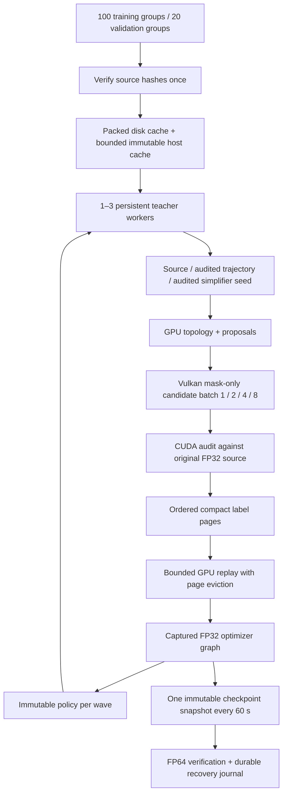

# Concurrent learning pipeline implementation

The accepted next-run plan targets 100 independent training source groups and
20 validation groups, packed preparation, deeper audited training states,
concurrent teacher/learner work and time-based checkpoints. Core geometry and
network arithmetic remain FP32; visual and numerical limits are unchanged.
On 2026-09-30 the user authorized completing validation and then starting a
two-hour full learning cycle, and increased the same additional grant to $10.
`next-training.json` records the selected settings. The cloud job still requires
its preflight gates to pass before starting the 120-minute learning clock.

## Previous run and first gate

`runpod-coverage-pretraining-04` stopped with `checkpoint FP64 export verification
failed` after 35.12 learning minutes. Its last verified checkpoint contains
3,404,800 optimizer updates and 14,134 states. Thirty-minute coverage and shading
diagnostics completed on the two diagnostic meshes. This is an incomplete run,
not evidence of improved generalization. Collection was checksum-verified and
compute/storage were released.

Recorded wall phases: teacher 1236.711 s, checkpoint handling 463.377 s, optimizer
387.880 s. Teacher candidate audits account for 678.796 s. These durations are
not a GPU idle-gap attribution; that requires a timeline. Median teacher-shard
triangle removal was 0.05423%, so deeper state coverage is also necessary.

The old failed probe was stored outside the results tree and lost at pod cleanup.
Checkpoint failures now retain model, optimizer, probe and verification files
under the run's `checkpoint-failures`, without advancing the recovery journal.
`blitz-neural-cycle --replay-checkpoint SOURCE NEW_OUTPUT UPDATES` loads the
checksummed dataset, optimizer and sampler state without modifying SOURCE. Its
report identifies the new build/device; it does not claim an identical resume.

RTX 2080 replay initially passed 1,024 and 16,384 additional updates from step
3,404,800; the subsequent L40S reproduction below explains the device difference.
Numerical acceptance remains the existing
finite, same-shape, maximum absolute difference <= 2e-4 contract.

## Implementation gates

- Reproduce/diagnose numerical failure, preserve evidence and protect recovery.
- Profile baseline and implement bounded stream/worker ownership and overlap.
- Freeze expanded corpus and cache preparation; preserve source audit references.
- Add persistent trajectories, bounded replay and checkpoint cadence controls.
- Add versioned model dimensions and quality-controlled width/replay experiments.
- Run local correctness, fixed-work comparisons and validation-only remote proof.
- Publish timings, bottlenecks, selected configuration and next-run readiness.

`pipeline-validation` rentals use the current pinned grant, including prior
attempts and a $1 reserve. Their entry point cannot launch the long training run.
The first forensic rental is capped at 35 minutes including setup/collection;
final pipeline validation is capped at 60 minutes.

## Implementation evidence (2026-09-30)

The second L40S forensic rental reproduced the failure after 512 updates from
step 3,404,800. Native CUDA and Torch agreed exactly. The FP64 error was
0.000232669987, with finite optimizer state and weight magnitudes up to 120.286.
The retained fixture exposes cancellation in the second hidden layer. FP32
compensated accumulation reduces this fixture's error to 0.00000408 on the local
GPU without changing the 0.0002 limit. Training and runtime inference share the
new kernel. The first implementation was slow; an eight-lane reduction cut its
measured optimizer duration by 3.8x. Further timing uses that parallel version.

The cloud archive is verified (`156eae6edac4e62761c6fc16b4679d8da0b481bc408068e808674a5e956341b0`),
and compute/storage are terminated. The earlier failed upload ran no validation;
its reproducible volume was also removed. Both attempts remain in the same grant.

The expanded corpus preserves the original assets/splits and adds independently
licensed CC0 groups: 100 training and 20 validation groups. All training assets
prepared successfully: 146,715,364 packed bytes and 219,612,020 reference bytes.
Category counts remain uneven (59 manufactured, 25 organic, 6 rocks, 10 stress);
the sampler balances category, asset, then progress bin. No release holdout enters
training or tuning.

Persistent teacher threads own nonblocking CUDA streams, Vulkan sessions and
policy buffers. A shared atomic ledger bounds native allocations. Immutable
policies are copied behind CUDA events once per bounded wave; completed jobs enter
replay in job-ID order. Wave descriptors, policy hashes, retained episode seeds,
sampler ordering and replay page identities are journaled. Fresh compact labels
pass directly to GPU replay; disk payloads remain recovery evidence. Replay evicts
old pages rather than clearing all history and uploads changed sampling bins.
Checkpoints default to 60 seconds plus audits/finalization; only one immutable
CPU snapshot can be pending. Source FP32 geometry remains the audit reference.

Width 64, 128 and 256 contracts passed locally, including native/FP64 parity,
checkpoint continuation, fused/reference gradients and bounded page eviction.
They contain 13,196 / 34,572 / 101,900 parameters. Width 64 remains selected until
the accepted quality gate supports a larger shape. Old implicit-width models
remain readable; larger shapes carry an explicit model-format dimension.

The small local matrix completed 12 combinations (1/2/3 workers, 1/2/4/8 candidate
lanes) with identical label hashes. Six two-state jobs took 2.04–2.39 seconds,
including startup, and produced 5.03–5.87 fresh states/s. Extra workers did not help
this tiny, shared-GPU case. These are smoke timings, not a corpus speedup claim.
The local GPU's other workloads leave roughly 0.2–0.7 GiB available; OOM attempts
are retained and excluded from timings. CPU CTest and ASan/UBSan each passed 13/13.
The 16,384-update continuation from the saved checkpoint passed with compensated
CUDA. Final remote validation remains required; no long training run is launched.

The two OOM cases from the full GPU CTest sweep passed when retried separately
with more available VRAM (device-update and resident-cycle contracts, 2/2).
The shared desktop workload subsequently reduced free VRAM to 51 MiB, preventing
the local interruption-proof attempts from even initializing CUDA streams.
Those attempts are retained without a timing or correctness claim. The learner
now owns one nonblocking stream borrowed by Torch instead of initializing Torch's
128-stream pool. The remote runner repeats interruption/recovery on an idle GPU.

The 20-second local Nsight sample contains 14.08 s in learner waits, 4.07 s in
optimizer windows and 8.45 s in nested candidate-audit ranges. These ranges overlap:
they are not additive. The sample records 8,861 `cudaMemcpyAsync` calls occupying
17.25 s of host API time, including readback waits. This is evidence for reducing
round trips and measuring overlap, not 17.25 s of memory-transfer GPU execution.
This capture used graph-level tracing; the remote capture requests graph nodes
to include optimizer kernels. Instrumented timings are separate from the
unprofiled fixed-work matrix.

CPU mesh decoding and topology workspace setup still occur on cache misses or
new episodes. The GPU action state and audited packing baseline are not yet
retained per asset; their measured cost remains visible in teacher phase timers.
Width/replay ablations are separate from frozen-policy throughput comparisons.
Width 64 is retained unless all three validation seeds satisfy the quality gate;
neither extra parameters nor a faster optimizer proves better LODs.

Seeded states now retain the original source scale and triangle denominator in
their network features. A 50%-retained seed therefore reports 50% progress rather
than restarting at LOD0. The deterministic GPU fixture protects this contract;
it and the numerical cancellation fixture passed after the change.

`throughput.mjs ablation` measures the 3 seeds × 3 widths × 4 replay amounts.
`width-quality.mjs ABLATION OUTPUT 128` separately audits each width on all frozen
validation groups, with identical gates and work budgets. A wider model needs
at least 5% improvement in mean per-asset retained-triangle ratio for each of the
three seeds, at no more than twice generation time. Every audit must complete;
partial comparisons retain width 64. The smallest width passing is selected.

The first L40S validation at revision `7144ec4` passed all 32 CTest contracts,
Vulkan validation layers, the resident optimizer memory check, and 16,384 updates
from the formerly failing checkpoint. The cancellation fixture's maximum CUDA
error was 0.0000035703; the continuation remained below the unchanged 0.0002
FP64 verification limit. Its verified archive hash is recorded in
`evidence/throughput-remote/validation-01/collection.json`.

That validation stopped during the interruption/recovery test: a reduced seed
was sent directly to the packed renderer before conversion to its fixed source
domain. Seeds now enter the packed GPU working representation before the
original-source audit, and the accepted GPU state is reused by the teacher.
Unsupported proposals are recorded as rejections and fall back to the audited
source baseline. A Vulkan fixture checks domain mapping, immutable input streams,
the unchanged coverage audit and rejection of unsupported UVs. Recovery and
the 100-mesh qualification still require a complete run; this attempt receives
no throughput or quality score. The pod and its volume were both deleted.

Readiness validation prioritizes exact interrupted/resumed recovery, a sustained
one-minute learning cycle with checkpoints and final quality audits, the fixed
work matrix, seeded episodes, and all 100 training meshes. The prior checkpoint
and initializer are also audited on all 20 validation groups. Optional wider
network experiments require an explicit validation configuration flag and do
not delay these gates. Width 64 remains the proposed training configuration.

The second L40S validation at `b96d040` passed all 32 tests, exact interrupted
recovery (98,304 updates and 48 fresh states, byte-identical policy and labels),
the GPU memory check, and Vulkan validation. Its one-minute learning window
produced 3,987 fresh states and 32,000 updates; full startup/finalization took
66.63 seconds. All six checkpoints and both diagnostic quality profiles passed.
The learned shelves coverage chain was 524 → 428 → 302 triangles; the fixed
ranking was 524 → 460 → 460. This is a two-mesh diagnostic, not a generalization
score or a causal comparison with the same run's starting policy.

All 100 training conditions qualified in 16.22 seconds: 95 produced a fresh
state and five had no legal training action. None had a representation failure.
The frozen pilot also passed (eight predecessor/empty outcomes remain recorded).
All 12 fixed-work configurations produced identical labels. For 96 fresh states
and 768 updates, one worker with eight candidates took 2.445 seconds, compared
with 3.301 seconds for one candidate (1.35×). More workers did not improve this
small-mesh test; this does not establish the best schedule for larger meshes.

The final 20-group model comparison hit its 4 GiB cap on three large meshes
(0.74–1.54 million triangles), so this run is not marked ready. Production action
ranking allocated a full `6 × triangles × 128` FP32 feature matrix, even for
unused action slots. Inference now generates bounded tiles (8 MiB at the default
16,384-row tile), preserving global action IDs and FP32 predictions. Geometric
rankings compute their score directly without an unused feature matrix. GPU
fixtures compare multiple tile sizes, rankings, and placement/reuse behavior;
large-mesh validation remains pending. Audit reports now record each row's
workspace peak and allocation refusal, and resource-interrupted audits cannot
be marked complete. Both models use the same cap on each comparison attempt.

The 15-second timeline recorded 44,122 CUDA copies and 11,653 CUDA/Vulkan
handoffs. Their host API durations summed to 9.08 seconds for copies and 10.09
seconds for semaphore calls across concurrent threads; these are overlapping
host times, not additive GPU execution. Candidate-audit ranges totaled 13.11
seconds across workers. The next large throughput opportunity is batching
candidate/camera work to reduce host readbacks and interop handoffs. Increasing
network width does not address those waits. Full raw evidence is retained in
the checksum-verified archive referenced by `validation-02/collection.json`.

## Final preparation and authorized launch

The third L40S validation (`010a4ee`) passed 32/32 CTests, Vulkan validation,
optimizer and action-kernel Compute Sanitizer checks, cancellation accuracy,
16,384-update checkpoint continuation, and exact interrupted/resumed recovery.
All 100 training conditions qualified again (95 fresh states, five valid empty
conditions). The new inference tile-size fixture passed, including one-row tiles,
placement/reuse, learned and geometric rankings. The archived run remains marked
incomplete: both final model-audit invocations rejected the runner-only memory
setting before any drawing. The parser now extracts that field before parsing
visual settings; CPU and ASan/UBSan fixtures protect range validation, immutable
input, unchanged visual settings, and rejection of unrelated unknown fields.

The unprofiled sustained test produced 4,227 fresh states and 33,920 updates in
65.180 seconds, including startup and final audits (60-second learning window).
It published six verified checkpoints. One-second telemetry measured 79.85%
mean GPU activity, 91% peak, and 1,076 MiB maximum memory during that phase.
Activity is not percent of theoretical arithmetic throughput. The exact starting
policy versus the final policy produced 375 versus 310 triangles for shelves
(source 524), and 3,048 versus 3,048 for the rock (source 3,304), with identical
bounded coverage audit settings. These two assets do not establish generalization
or shading quality. Raw evidence is in `evidence/throughput-remote/validation-03`;
its pod and volume are deleted after checksum-verified collection.

| Additive learner wall time | Seconds |
|---|---:|
| Wait for audited teacher examples | 53.838 |
| Training windows | 5.081 |
| Final quality audits | 4.577 |
| Startup/finalization remainder | 1.683 |

Optimizer execution within the training windows took 4.340 seconds, about
128 microseconds per update. Across two overlapping teachers, candidate audits
took 63.454 seconds out of 99.461 seconds of teacher work. Teacher durations
must not be added to learner wall time. Candidate construction took 3.831 s,
features/proposals 3.831 s, packing/baseline 5.832 s, commits 1.697 s, state setup
0.138 s, load/session 0.014 s, and other preparation 16.529 s. The remaining
4.134 s covers worker completion/publication overhead.

[Interactive timing hierarchy and architecture](viewer/throughput.html) contains
both local and remote fixed-work matrices. The latest L40S matrix produced
identical labels for all configurations: 96 states and 768 updates took 2.935 s
with one worker/one lane, 2.074 s with two workers/four lanes, and 2.021 s with two
workers/eight lanes. Rankings changed slightly across rentals, so training retains
the sustained-tested two-worker/four-lane configuration. Width 64, 16 states per
episode, 128 updates per shard, compact data and packed meshes remain selected.
No wider-policy quality claim is made.

The launch bundle includes all 100 training and 20 validation groups. Before the
long run it executes a full curriculum pass with the selected settings and
repeats the previous-checkpoint/initializer audits at matching workspace caps.
A failure leaves the long run unstarted. Learning then receives its own full
120 minutes, with 60-second checkpoints, half-hour coverage/shading diagnostics,
and extra finalization time. A final 20-group audit compares the saved initializer
and final policy with identical bounded generation settings. Initial weights
come from the verified saved initializer; Adam is fresh. The interrupted older
checkpoint remains a separate comparison rather than an implicit resume.

The next major optimization remains batching candidate/camera audits to reduce
CPU readbacks and CUDA/Vulkan handoffs. Optimizer-only work is roughly 6.7% of
this measured wall time, so increasing network width or tuning the optimizer
cannot remove the dominant wait for examples. Further optimization does not
need to delay the authorized training once its remaining preflight passes.

The first authorized expanded-run rental passed all 32 CTests but stopped before
training: running the entire Vulkan Cartesian test matrix under Compute Sanitizer
exceeded its three-minute deadline without a diagnostic or completion. This is
retained as an incomplete check, not a pass. The full matrix remains in CTest and
Vulkan validation-layer runs. A dedicated `--memcheck` invocation now instruments
the maximum candidate lane count, valid/invalid candidates, both attachment
layouts, pruning, fixed-domain seed conversion, concurrent shared ownership,
and mask/full/bitset readback equality. This keeps memory-boundary coverage within
the bounded setup window. Compute/storage were released after verified collection;
the retry spends the same $10 grant. Local compilation and runner contracts passed;
the shared local GPU had only 74 MiB free, so the GPU proof remains remote.

## Training launched: 2026-09-30 21:17:58 UTC

Rental `runpod-expanded-pretraining-02`, revision `a587c33`, passed all 32 CTests,
Vulkan validation, both Compute Sanitizer checks (zero errors), and the complete
selected-configuration preflight. Its 100 conditions produced 1,536 fresh states
and 12,288 updates in 64.05 s, with zero failures and four valid empty conditions.
Peak tracked GPU allocation was 2,788,481,506 bytes (2.60 GiB). These larger-mesh
measurements use the real 16-state, 128-update, two-worker/four-lane configuration.

Both previous and initial policies completed all 20 validation groups at the
original 4,096 MiB cap; the 16 GiB fallback was unnecessary. All 80 rows (20 assets
× two rankings × two models) completed. The 1,537,926-triangle cliff peaked at
4,041.67 MiB for the previous learned policy and 4,037.16 MiB for the initializer.
The two complete model audits took 49.08 and 46.87 s. The former memory blocker is
resolved. These audits retain the same small generation-work budget and do not
measure the best achievable triangle reduction.

The two-hour learning window began at 21:17:58 UTC (23:17:58 Europe/Warsaw), with
an estimated learning end at 23:17:58 UTC (01:17:58 on October 1 in Warsaw), followed
by finalization and the matched 20-group audit. A four-minute durable snapshot
contains 56,448 updates and 7,044 fresh states, with zero failed conditions. Its
checkpoint checksum matches the recovery journal. Across 270 one-second samples,
GPU activity averaged 76.48%, peaked at 95%, and GPU memory peaked at 2,988 MiB.
This is running-job evidence, not completed training or a final quality score.

The expanded preflight retained 281 MiB in 64 s. That observed storage growth,
plus the final archive, exceeds the original 20 GB volume over two hours. The
same volume was enlarged to 80 GB without interrupting training, and subsequent
L40S preparations use 80 GB. Up to $0.10 of the existing $1 reserve is assigned
to the additional storage; the total additional grant remains $10. Capacity
expansion and standard storage pricing are documented by
[RunPod](https://docs.runpod.io/storage/network-volumes).

Stable preflight reports, launch arguments, first checkpoint verification and
telemetry are in `evidence/throughput-remote/training-launch`. These are historical
snapshots; the failed outcome below supersedes their running status.

## Packed candidate failure and repair (2026-10-01)

The run stopped after 720.776 seconds, before completing two hours. Shard 1394
(`ph_wooden_display_shelves_01`, audited QEM seed at 25% retention) threw a packed
draw exception. The durable, checksum-verified checkpoint contains 160,256
updates and 20,014 states. Results were collected and both compute and volume
were deleted. The incomplete run has no score. The frozen policy, condition and
outcome are in `evidence/packed-domain-failure`.

Replaying its policy and condition on the RTX 2080 reproduced the error. An
out-of-bounds edit affected a vertex whose final incident triangle disappeared.
The triangle validation kernel therefore skipped it, while the packed renderer
still validated the retained vertex slot. A deterministic two-triangle regression
failed before the fix. Stream validation now runs in the vertex-writing kernel,
and the triangle kernel retains orientation/UV-foldover checks. Invalid candidates
are rejected independently in serial and indirect batches, before drawing or
commit; no additional kernel or host readback is added. Rejection counts remain
visible in teacher records.

Related checks now reject nonfinite proposed normals before normalization,
nonfinite/out-of-range working UVs, nonfinite draw positions, and malformed fixed
domains (NaN/infinite lower bounds, negative/infinite extent, overflowing upper
bounds). The same domain check runs before host cache encoding/decoding and GPU
working-mesh construction, preventing NaN-to-integer encoding as well as invalid
draws. Draw exceptions name the failing lane and violated contract. Visual
limits, source FP32 references and the referenced-vertex exact-position cap are
unchanged. The distinction between stored vertices and indexed drawing follows
the [Vulkan drawing contract](https://docs.vulkan.org/spec/latest/chapters/drawing.html).

Local validation: 32/32 CTest, 13/13 ASan/UBSan tests, and zero Compute Sanitizer
errors for action generation and Vulkan candidate/ownership boundaries. The
saved failure now completes 16 audited steps (793 to 761 triangles), rejecting
157 invalid alternatives. Serial, four-lane and eight-lane runs produce identical
label and episode hashes. Shared-workstation episode times were 0.779 / 0.620 /
0.578 seconds, single observations rather than a speedup benchmark. Source
coverage upper bound is 2.207108 pixels against the unchanged 3-pixel limit;
changed area is 0.014567 against 0.5. Raw evidence is in
`evidence/packed-domain-local`.

The next remote gate runs the saved failure, sanitizer checks and a separate
20-minute adaptive learning soak on all 100 training groups, initialized from the
failing policy. It must pass the former failing condition, duration and coverage
gates before another two-hour run. This validation does not count toward those
two hours and does not establish release shading quality.

The first remote repair validation (`runpod-packed-validation-01`, `fb4943f`)
passed all 32 CTest contracts, a 16,384-update checkpoint continuation and the
action memory check. Its Vulkan memory check did not finish within five minutes;
no sanitizer verdict was produced. The attempt was cancelled, collected and its
resources deleted before the soak. It is not a passing validation.

This exposed a supervisor bug: Node reports signal termination with `code=null`,
which the old truthiness check treated as success. The bounded subprocess runner
now records exit code, signal, timeout and cancellation separately, requires a
clean zero exit, and kills the complete owned process group. Tests exercise real
zero/nonzero exits, SIGTERM, timeout and cancellation. Instrumented Vulkan tests
now log each stage and domain case. The complete local memory check passes with
both loading modes. The next remote attempt loads modules/data eagerly during
memory instrumentation, retaining every check. This tests the context-synchronizing
module-loading hypothesis documented in NVIDIA's
[CUDA guide](https://docs.nvidia.com/cuda/archive/12.8.1/pdf/CUDA_C_Programming_Guide.pdf);
it is not yet a diagnosis of the remote stall.

The follow-up search found the same truthiness bug in the throughput and width
comparison subprocesses. Both now use the bounded process runner; width selection
also requires successful execution, independently of a complete-looking audit
file. Replay, soak and preflight callbacks require explicit zero exits, and the
long-run supervisor rejects cancellation even if its child exits gracefully.
This follows the documented [Node signal-exit contract](https://nodejs.org/api/child_process.html#event-close).
Tests launch real fixture processes that write complete-looking reports and then
exit zero, nonzero or by signal; only the successful execution is eligible.

A second packing boundary was in host cache serialization: an explicit valid
domain could silently clamp positions outside that domain. A regression failed
before the fix. Encoding now rejects those positions before publishing bytes,
and decoding rejects exact-position exceptions outside the stored bounds. Tests
cover the first representable value beyond lower/upper and zero-extent bounds,
both compact and exact positions, malformed serialized exceptions, and valid
round trips. Focused CTest and ASan/UBSan checks pass. The saved failure still
produces identical labels and episodes across 1/4/8 lanes after this change.
These host checks run during cache I/O, not as new kernels in the update loop.
Additional raw evidence is in `evidence/packed-domain-local/neighbors`.
