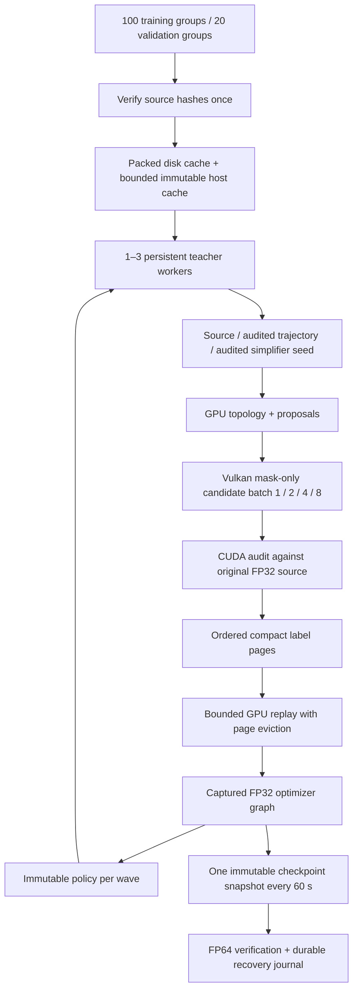

# Concurrent learning pipeline implementation

The accepted next-run plan targets 100 independent training source groups and
20 validation groups, packed preparation, deeper audited training states,
concurrent teacher/learner work and time-based checkpoints. Core geometry and
network arithmetic remain FP32; visual and numerical limits are unchanged.
The next two-hour run must remain unlaunched during this preparation.

## Previous run and first gate

`runpod-coverage-pretraining-04` stopped with `checkpoint FP64 export verification
failed` after 35.12 learning minutes. Its last verified checkpoint contains
3,404,800 optimizer updates and 14,134 states. Thirty-minute coverage and shading
diagnostics completed on the two diagnostic meshes. This is an incomplete run,
not evidence of improved generalization. Collection was checksum-verified and
compute/storage were released.

Recorded wall phases: teacher 1236.711 s, checkpoint handling 463.377 s, optimizer
387.880 s. Teacher candidate audits account for 678.796 s. These durations are
not a GPU idle-gap attribution; that requires a timeline. Median teacher-shard
triangle removal was 0.05423%, so deeper state coverage is also necessary.

The old failed probe was stored outside the results tree and lost at pod cleanup.
Checkpoint failures now retain model, optimizer, probe and verification files
under the run's `checkpoint-failures`, without advancing the recovery journal.
`blitz-neural-cycle --replay-checkpoint SOURCE NEW_OUTPUT UPDATES` loads the
checksummed dataset, optimizer and sampler state without modifying SOURCE. Its
report identifies the new build/device; it does not claim an identical resume.

RTX 2080 replay initially passed 1,024 and 16,384 additional updates from step
3,404,800; the subsequent L40S reproduction below explains the device difference.
Numerical acceptance remains the existing
finite, same-shape, maximum absolute difference <= 2e-4 contract.

## Implementation gates

- Reproduce/diagnose numerical failure, preserve evidence and protect recovery.
- Profile baseline and implement bounded stream/worker ownership and overlap.
- Freeze expanded corpus and cache preparation; preserve source audit references.
- Add persistent trajectories, bounded replay and checkpoint cadence controls.
- Add versioned model dimensions and quality-controlled width/replay experiments.
- Run local correctness, fixed-work comparisons and validation-only remote proof.
- Publish timings, bottlenecks, selected configuration and next-run readiness.

`pipeline-validation` rentals use the current pinned $8 grant, including prior
attempts and a $1 reserve. Their entry point cannot launch the long training run.
The first forensic rental is capped at 35 minutes including setup/collection;
final pipeline validation is capped at 60 minutes.

## Implementation evidence (2026-09-30)

The second L40S forensic rental reproduced the failure after 512 updates from
step 3,404,800. Native CUDA and Torch agreed exactly. The FP64 error was
0.000232669987, with finite optimizer state and weight magnitudes up to 120.286.
The retained fixture exposes cancellation in the second hidden layer. FP32
compensated accumulation reduces this fixture's error to 0.00000408 on the local
GPU without changing the 0.0002 limit. Training and runtime inference share the
new kernel. The first implementation was slow; an eight-lane reduction cut its
measured optimizer duration by 3.8x. Further timing uses that parallel version.

The cloud archive is verified (`156eae6edac4e62761c6fc16b4679d8da0b481bc408068e808674a5e956341b0`),
and compute/storage are terminated. The earlier failed upload ran no validation;
its reproducible volume was also removed. Both attempts remain in the same grant.

The expanded corpus preserves the original assets/splits and adds independently
licensed CC0 groups: 100 training and 20 validation groups. All training assets
prepared successfully: 146,715,364 packed bytes and 219,612,020 reference bytes.
Category counts remain uneven (59 manufactured, 25 organic, 6 rocks, 10 stress);
the sampler balances category, asset, then progress bin. No release holdout enters
training or tuning.

Persistent teacher threads own nonblocking CUDA streams, Vulkan sessions and
policy buffers. A shared atomic ledger bounds native allocations. Immutable
policies are copied behind CUDA events once per bounded wave; completed jobs enter
replay in job-ID order. Wave descriptors, policy hashes, retained episode seeds,
sampler ordering and replay page identities are journaled. Fresh compact labels
pass directly to GPU replay; disk payloads remain recovery evidence. Replay evicts
old pages rather than clearing all history and uploads changed sampling bins.
Checkpoints default to 60 seconds plus audits/finalization; only one immutable
CPU snapshot can be pending. Source FP32 geometry remains the audit reference.

Width 64, 128 and 256 contracts passed locally, including native/FP64 parity,
checkpoint continuation, fused/reference gradients and bounded page eviction.
They contain 13,196 / 34,572 / 101,900 parameters. Width 64 remains selected until
the accepted quality gate supports a larger shape. Old implicit-width models
remain readable; larger shapes carry an explicit model-format dimension.

The small local matrix completed 12 combinations (1/2/3 workers, 1/2/4/8 candidate
lanes) with identical label hashes. Six two-state jobs took 2.04–2.39 seconds,
including startup, and produced 5.03–5.87 fresh states/s. Extra workers did not help
this tiny, shared-GPU case. These are smoke timings, not a corpus speedup claim.
The local GPU's other workloads leave roughly 0.2–0.7 GiB available; OOM attempts
are retained and excluded from timings. CPU CTest and ASan/UBSan each passed 13/13.
The 16,384-update continuation from the saved checkpoint passed with compensated
CUDA. Final remote validation remains required; no long training run is launched.

The two OOM cases from the full GPU CTest sweep passed when retried separately
with more available VRAM (device-update and resident-cycle contracts, 2/2).
The shared desktop workload subsequently reduced free VRAM to 51 MiB, preventing
the local interruption-proof attempts from even initializing CUDA streams.
Those attempts are retained without a timing or correctness claim. The learner
now owns one nonblocking stream borrowed by Torch instead of initializing Torch's
128-stream pool. The remote runner repeats interruption/recovery on an idle GPU.

The 20-second local Nsight sample contains 14.08 s in learner waits, 4.07 s in
optimizer windows and 8.45 s in nested candidate-audit ranges. These ranges overlap:
they are not additive. The sample records 8,861 `cudaMemcpyAsync` calls occupying
17.25 s of host API time, including readback waits. This is evidence for reducing
round trips and measuring overlap, not 17.25 s of memory-transfer GPU execution.
This capture used graph-level tracing; the remote capture requests graph nodes
to include optimizer kernels. Instrumented timings are separate from the
unprofiled fixed-work matrix.

CPU mesh decoding and topology workspace setup still occur on cache misses or
new episodes. The GPU action state and audited packing baseline are not yet
retained per asset; their measured cost remains visible in teacher phase timers.
Width/replay ablations are separate from frozen-policy throughput comparisons.
Width 64 is retained unless all three validation seeds satisfy the quality gate;
neither extra parameters nor a faster optimizer proves better LODs.

Seeded states now retain the original source scale and triangle denominator in
their network features. A 50%-retained seed therefore reports 50% progress rather
than restarting at LOD0. The deterministic GPU fixture protects this contract;
it and the numerical cancellation fixture passed after the change.

`throughput.mjs ablation` measures the 3 seeds × 3 widths × 4 replay amounts.
`width-quality.mjs ABLATION OUTPUT 128` separately audits each width on all frozen
validation groups, with identical gates and work budgets. A wider model needs
at least 5% improvement in mean per-asset retained-triangle ratio for each of the
three seeds, at no more than twice generation time. Every audit must complete;
partial comparisons retain width 64. The smallest width passing is selected.

The first L40S validation at revision `7144ec4` passed all 32 CTest contracts,
Vulkan validation layers, the resident optimizer memory check, and 16,384 updates
from the formerly failing checkpoint. The cancellation fixture's maximum CUDA
error was 0.0000035703; the continuation remained below the unchanged 0.0002
FP64 verification limit. Its verified archive hash is recorded in
`evidence/throughput-remote/validation-01/collection.json`.

That validation stopped during the interruption/recovery test: a reduced seed
was sent directly to the packed renderer before conversion to its fixed source
domain. Seeds now enter the packed GPU working representation before the
original-source audit, and the accepted GPU state is reused by the teacher.
Unsupported proposals are recorded as rejections and fall back to the audited
source baseline. A Vulkan fixture checks domain mapping, immutable input streams,
the unchanged coverage audit and rejection of unsupported UVs. Recovery and
the 100-mesh qualification still require a complete run; this attempt receives
no throughput or quality score. The pod and its volume were both deleted.

Readiness validation prioritizes exact interrupted/resumed recovery, a sustained
one-minute learning cycle with checkpoints and final quality audits, the fixed
work matrix, seeded episodes, and all 100 training meshes. The prior checkpoint
and initializer are also audited on all 20 validation groups. Optional wider
network experiments require an explicit validation configuration flag and do
not delay these gates. Width 64 remains the proposed training configuration.
