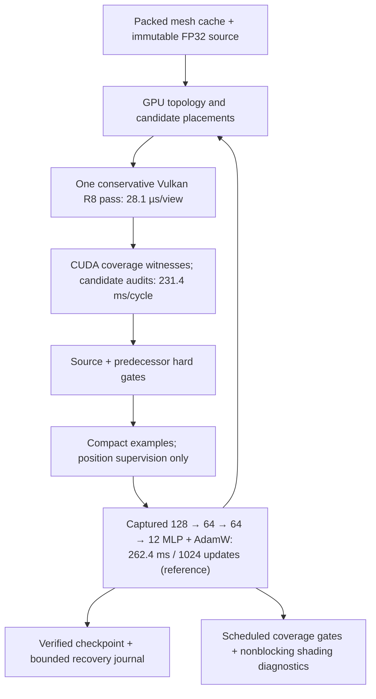

# Coverage pretraining before the two-hour run

Five alternating runs with the same coverage objective, teacher inputs and update budget:

| Full cycle | Median seconds |
|---|---:|
| Legacy attachments, reference optimizer | 1.123499 |
| Mask-only, reference optimizer | 1.072565 |
| Mask-only, fused optimizer | 1.024252 |

Mask renderer whole-cycle speedup: 1.05×.
Median teacher time: 0.372884 s; training phase:
0.332639 s. Setup and final publication are included
in whole-cycle time. Per-phase, transfer, allocation and draw counters are in
matched-coverage.json; GPU packing/render/unpack timestamps are in raster.json.
Selected update backend: reference. Selection requires at least 5%
lower median full-cycle time plus numerical and restart checks.

Median stage timings for mask-only coverage with the reference optimizer:

| Stage | Milliseconds |
|---|---:|
| Teacher total | 372.884 |
| ↳ Load and session | 22.360 |
| ↳ Packing and baseline gates | 34.855 |
| ↳ GPU state setup | 4.450 |
| ↳ Features and proposals | 22.033 |
| ↳ Candidate construction | 3.707 |
| ↳ Candidate audits | 231.387 |
| ↳ Commit | 1.144 |
| ↳ Final gates, serialization and remaining preparation | 46.601 |
| Training total | 332.639 |
| ↳ Dataset append | 10.895 |
| ↳ Graph capture | 47.145 |
| ↳ Optimizer updates | 262.350 |
| ↳ Checkpoint snapshot/enqueue/wait | 17.405 |

Medians of sub-stages need not add to the median total. Asynchronous checkpoint
publication overlaps the cycle. These are bounded cold cycles with two teacher
states; persistent training amortizes setup and graph capture.

Hardware profile: median packed full/mask GPU raster time
50.5 / 28.1 µs per view;
renderer workspace 19329678 / 6702862 bytes.
All mask/full coverage pixels match. Packing/interop wall time is reported
separately in raster.json; GPU draw speedup is not whole-cycle speedup.

Positions are UNORM16 in mesh bounds with at most 5% exact FP32 exceptions among
referenced surviving vertex IDs. Normals/tangents use 10-bit components and sign;
UVs use UNORM16 in [-8,8], colors RGBA8. Coverage draws skip attribute packing.
Reference masks use one bit/pixel; candidates can be read directly from R8 surfaces.
Remaining repeated work is teacher topology, candidate/view draws, exact fallback
distance transforms, and host decisions/synchronization. The masked objective
does not supervise appearance; these checkpoints require shading-aware fine-tuning.

Learning lasts at least 120 minutes, with 10 additional minutes for finalization.
Interrupted downtime is excluded. This development pilot is not a release score.
