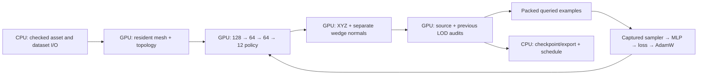

# GPU learning pipeline before the two-hour cycle

GPU: NVIDIA RTX PRO 6000 Blackwell Server Edition. Median 1,024-update device window: captured 0.125676 s, eager 0.429389 s (3.42×). Startup, capture and checkpoint times are separate in validation.json. Eager/captured and interrupted/continued model payloads agree exactly. Cross-GPU native/FP64 replay passed.

Topology and cache timings, raster counts, transfers and useful accepted actions are in profile.json. Audits still orchestrate views/refinement and tile allocation on the host; all raster, distance and appearance calculations remain on GPU. Audit FP64 work, repeated candidate renders and teacher search dominate the learning cycle; optimizer throughput is not a quality score.

V3: 13,196 FP32 parameters (52,784 bytes). Each action keeps 86 FP32 values, 32 flag bits, 8 label bits and up to 9 masked FP32 targets; 8 conditions are shared by a state. Geometry IDs are uint32; material IDs are uint16. No lossy feature quantization.

The frozen two-asset diagnostic uses fewer views than the full protocol. Audited cameras do not guarantee every view or global optimality. Hard source/previous gates are independent of learned pass logits. Missing normal streams remain flat shaded.
