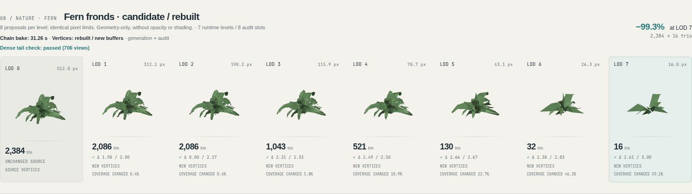
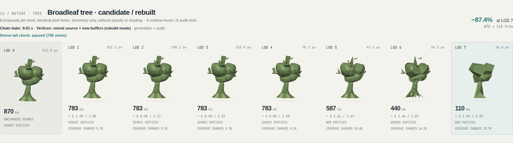

# Vegetation LOD comparisons

Open [index.html](index.html) in a browser. It is an offline, self-contained
board with 20 chains and 160 scheduled LOD tiles. The first four rows preserve
archived opaque examples. The remaining rows show fern/tree before and after
in both vertex modes, plus grass, shrub, flowers and branch candidates.

The new comparisons use the same eight proposals per level and pixel limits.
Every chain includes measured bake seconds; every LOD labels actual source or
new vertex storage. Mixed-buffer chains are identified in the header. Toggle
runtime levels to hide exact duplicates, or target scale to inspect the distant
LODs at their intended sizes. Click a tile for a rotatable comparison with LOD0.

All 16 nature chains shown here passed the independent dense tail check.
Coverage-area change remains visible: a pixel-distance pass does not certify
opacity, shading or equal filled area. See the [research report](../REPORT.md)
and [full measurements](../RESULTS.md), including slower 32/64-proposal runs,
meshoptimizer comparisons and individual regressions.

[Browser checks](browser-checks.json) verify geometry counts, time/storage
labels, comparison and audit text, inspector controls, offline operation and
desktop/mobile layout. [Manifest](manifest.json) records chain hashes and source
credits. Presentation angles are not audit cameras.
